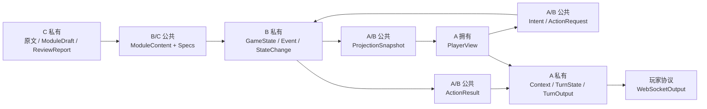

# 数据模型设计

状态：**现行（MVP）**  
适用范围：`agent-collaboration-framework`  
架构决议：[`architecture.md`](architecture.md)

本文说明当前 A（主持编排）、B（确定性规则引擎）和 C（模组解析/审查）的数据模型所有权、跨边界字段和不变式。

当前模型的事实源顺序为：

1. `collaboration_framework/contracts/` 中的 Pydantic 模型；
2. `collaboration_framework/ports/` 中的 Protocol；
3. `host/schemas/` 与 `engine/models.py` 中的内部模型；
4. 自动生成的 `schemas/*.schema.json`；
5. 本文。

如果文档与生成的 Schema 冲突，以 Pydantic 和生成的 Schema 为准，并在同一个 PR 中修正文档。

## 1. 分层与所有权



| 模型组 | 所有者/共同评审者 | 消费者 | 禁止包含 |
|---|---|---|---|
| `ModuleContent` 与声明式 Specs | B/C | B、C、组合根 | GameState、运行时 Event、骰子结果、Prompt |
| `ProjectionSnapshot` | A/B | A | GameState 对象、秘密、内部 Event、写命令 |
| `PlayerView` | A | A 的模型端口、Gateway | 其他玩家私有信息、模组秘密、状态写入口 |
| `Intent` / `ActionRequest` | A/B | A、B | `execution` 旁路、Dice 结果、StateChange |
| `ActionResult` | A/B | A | GameState、完整 Event payload、内部规则轨迹 |
| A 的 Context/Turn 模型 | A | 仅 `host/` | B/C 内部对象 |
| A 的 Host Agent Context/Usage/Event 与工具模型 | A | 仅 `host/` Adapter | GameState、ModuleContent、完整 Event、数据库/身份入口、SDK 对象、Prompt、reasoning、工具原始参数/结果 |
| B 的状态/Event/执行结果 | B | 仅 `engine/` 和 B 的测试 | A 模型上下文、WebSocket DTO |

## 2. 公共模型基础规则

跨边界模型继承 `ContractModel`：

- `extra="forbid"`：拒绝未知字段；
- `frozen=True`：创建后不可原地修改；
- `populate_by_name=True`：支持明确的字段别名；
- `str_strip_whitespace=True`：清理字符串两端空白。

`ContractError` 表示结构已通过 Pydantic，但违反房间身份、视图版本、可信候选或幂等键等确定性边界。

模型 adapter 返回的 `JsonObject` 只是 raw JSON。它必须经过 `IntentParser` 或 `Narrator` 校验，不能直接进入 Orchestrator 的后续步骤。

## 3. 回合输入：`PlayerInput`

定义：`contracts/runtime.py`

| 字段 | 类型 | 语义 |
|---|---|---|
| `room_id` | `str` | 可信房间身份 |
| `player_id` | `str` | 当前连接对应的玩家 |
| `actor_id` | `str` | 玩家在房间中控制的角色 |
| `client_action_id` | `str` | 客户端幂等键；映射为 `ActionRequest.request_id` |
| `utterance` | `str` | 玩家自由语言输入 |

生产 Gateway 必须从认证连接和房间绑定建立身份字段，不能只信任客户端 JSON。B 在执行时仍复核 Actor 与 Player 的绑定。

## 4. 安全投影

定义：`contracts/player_view.py`

### 4.1 `ProjectionSnapshot`

这是 B 通过 `PlayerViewSource.read()` 提供的只读、与 `GameState` 解耦的安全投影源。

| 字段 | 类型 | 语义 |
|---|---|---|
| `room_id/player_id/actor_id` | `str` | 快照所属房间与已校验的玩家/角色作用域 |
| `scene_id` | `str` | 当前 Scene |
| `phase` | `playing \| ended` | 当前阶段 |
| `revision` | `str` | 不透明投影版本；当前 InMemory Store 来自 `event_sequence` |
| `self_actor` | `ProjectionSelfActor` | 从当前 `ActorState` 白名单投影的角色快照 |
| `scene` | `ProjectionScene` | 显式玩家可见的场景、实体、人物与出口 |
| `location_context` | `ProjectionLocationContext \| None` | 当前地点的安全面包屑与可选的门禁前沿；边界中断时不会把门后地点标成当前位置 |
| `known_locations` | `tuple[ProjectionKnownLocation, ...]` | 按 `LocationKnowledge` 过滤的全部玩家已知地点；层级与一跳出口分离 |
| `inventory` | `tuple[InventoryItemView, ...]` | 当前 Actor 持有且已识别的 `ItemInstance` |
| `world` | `ProjectionWorldState` | 场景之外的玩家安全世界事实：`day_index`、`hour_of_day`、`time_of_day`、`core_resolved`、`ending_available`、`ending_id` |
| `known_information` | `tuple[ProjectionKnownInformation, ...]` | 按 actor/party 发现作用域过滤的已知信息 |
| `checkpoint_options` | `tuple[ProjectionCheckpointOption, ...]` | 当前可信 Checkpoint 候选 |

`ProjectionEntity` 只含 `id/kind/name/aliases/description/narrative_details/observable_state`。其中
`observable_state` 逐项来自 `EntitySpec.observable_state` allow-list，不复制原始 Entity state。

`ProjectionCheckpointOption` 只含
`id/target_id/action_hint/skills/difficulty/declaration_options`。`action_hint`
是该 Checkpoint 的规则动作 id；`declaration_options` 是模组随当前可见
Checkpoint 发布的玩家安全语义候选，每项只包含声明 id 与 `semantic_hints`。

### 4.2 `PlayerView`

A 的 `PlayerViewProjector` 从安全快照构造面向当前玩家的视图：

| 字段 | 类型 | 语义 |
|---|---|---|
| `room_id/player_id/actor_id` | `str` | 当前玩家上下文 |
| `scene_id` | `str` | 当前 Scene |
| `phase` | `playing \| ended` | 当前阶段 |
| `revision` | `str` | 当前视图版本 |
| `self_actor` | `SelfActorView` | 当前 Actor 的属性、技能、资源、条件、装备和安全背景摘要 |
| `scene` | `SceneView` | 场景安全名称/描述/时间及 `visible_entities`、`visible_actors`、`available_exits`、`loose_items` |
| `location_context` | `LocationContextView \| None` | `ProjectionLocationContext` 的玩家侧镜像，提供 Region - Site - Room 面包屑和门禁位置上下文 |
| `known_locations` | `tuple[KnownLocationView, ...]` | 玩家知道存在的地点全集；前端按 `parent_location_id` 分层，不把导航边当作包含关系 |
| `inventory` | `tuple[InventoryItemView, ...]` | 与角色卡文本装备分离的局内权威背包投影 |
| `world` | `WorldStateView` | `ProjectionWorldState` 的玩家侧镜像；时间、主线解决、结局开放与已确认 `EndingResolution` 只有经由它才可观测 |
| `known_information` | `tuple[KnownInformationView, ...]` | 可检索的个人或队伍已知信息 |
| `checkpoint_options` | `tuple[CheckpointOption, ...]` | A 可选择的可信候选；可包含当前 Checkpoint 授权的 `declaration_options` |

`PlayerView` 是一次 Intent Model 或 Host Agent 调用的完整、不可变、revision-bound
玩家上下文。B 负责先去除权威状态和秘密；A 不得直接读取 `GameState` 或完整
`ModuleContent`。`SelfActorView` 明确不包含私人 `notes`；其他 Actor 只有公开名称和
`status_summary`，没有完整角色卡。

### 4.3 `KeeperCapabilityView`

定义：`contracts/keeper_view.py`。这是 #212 流程图里 `受控 GMView / Canon 图谱` 的落地：
`PlayerView` 按设计不含尚未发现的 Canon Information、不在当前场景的 Entity 和 Ending id，
因此仅凭它，Agent 只可能产出 `enter_location` 与 `narrative_only` 两种效果。

| 字段 | 类型 | 语义 |
|---|---|---|
| `room_id/actor_id` | `str` | 与配套 `PlayerView` 相同的作用域 |
| `revision` | `str` | 必须与配套 `PlayerView.revision` 相同 |
| `information` | `tuple[KeeperInformationCapability, ...]` | 全部 Canon Information 及其 `known_by_party/known_by_actor` |
| `locations` | `tuple[KeeperLocationCapability, ...]` | Canon Scene 与 Runtime Location，含 `origin`、`is_current` |
| `entities` | `tuple[KeeperEntityCapability, ...]` | Canon 与 Runtime Entity 的当前 `location_id/holder_actor_id/consumed` |
| `endings` | `tuple[KeeperEndingCapability, ...]` | 可提交的结局 id 与玩家安全摘要 |
| `core_resolved` / `ending_available` | `bool` | 当前主线与结局开放状态 |

边界：它只进入 planner 与步骤裁决两处模型调用，不进入 `ActionPlanNarrationContext`，
也不出现在任何传输给客户端的 payload 里。Engine 在 submit 时用同一份 runtime 快照重新
校验其中出现的每一个 id，因此它是"词汇表"而不是授权。

## 5. 意图模型：`Intent`

定义：`contracts/action.py`

| 字段 | 类型 | 语义 |
|---|---|---|
| `kind` | `action \| dialogue \| unknown` | 高层语义类型 |
| `verb` | `str` | 开放动作词，不使用封闭 Enum |
| `target` | `MatchedTarget \| UnmatchedTarget` | 以 `matched` 为 discriminator |
| `check` | `NoCheck \| ModuleCheck \| DefaultCheck` | 以 `route` 为 discriminator |
| `approach` | `str \| None` | 玩家表达的方式 |
| `declarations` | `tuple[str, ...]` | 模型从当前所选 Checkpoint 的 `declaration_options` 中按玩家语义选择并原样复制的声明 id |
| `initiated_by_target` | `bool` | 动作是否由目标方先发起，用于攻击等 Hook 判定 |
| `summary` | `str` | 简短语义摘要 |
| `clarification_question` | `str \| None` | unknown 的澄清问题 |

`Intent` 没有 `execution`。所有通过 Schema 和可信候选校验的 Intent 都调用一次 `ActionExecutor.execute()`。

### 5.1 Target

```text
MatchedTarget:   matched=true,  id
UnmatchedTarget: matched=false, raw
```

discriminator 会拒绝同时携带 `id/raw` 等歧义结构。

### 5.2 Check

```text
NoCheck:      route="none"
ModuleCheck:  route="module", checkpoint_id, proposed_skills
DefaultCheck: route="default", proposed_skills
```

A 只能从 `PlayerView.checkpoint_options` 选择 Checkpoint、对应 Target 和技能。B 复核 Scene/Target/Checkpoint/skills，但不要求自由语言 `verb` 与 `action_hint` 字面相等。

### 5.3 结构不变式

- unknown 必须使用 `UnmatchedTarget` 和 `NoCheck`，并提供澄清问题；
- action/dialogue 必须使用 `MatchedTarget`，不得携带澄清问题。

## 6. 命令：`ActionRequest`

定义：`contracts/action.py`

| 字段 | 类型 | 语义 |
|---|---|---|
| `request_id` | `str` | 幂等键，来自 `client_action_id` |
| `room_id/player_id/actor_id` | `str` | 可信执行作用域 |
| `source_view_revision` | `str` | A 解析 Intent 时所基于的视图版本 |
| `input_fingerprint` | `str \| None` | 规范化 `PlayerInput` 的不透明 SHA-256 指纹；用于拒绝同一幂等键搭配不同玩家输入 |
| `intent` | `Intent` | 已校验的语义提议 |

首次执行时，A 根据规范化 `PlayerInput` 生成 `input_fingerprint`，但不把原始
`utterance` 放入 B 的持久化命令。B 校验身份绑定、source revision、当前 Scene、
Target、Checkpoint、skills 和 request id 占用情况。

## 7. 安全结果：`ActionResult`

定义：`contracts/action.py`

| 字段 | 类型 | 语义 |
|---|---|---|
| `request_id` | `str` | 对应命令 |
| `action_id` | `str` | 引擎动作标识 |
| `resolution` | `checkpoint \| direct \| blocked \| unrecognized` | B 使用的处理路径 |
| `outcome` | `success \| failure \| not_applicable` | 确定性结果 |
| `check_result` | `RuleCheckResult \| None` | 玩家安全的权威检定结果；无检定时为空 |
| `visible_facts` | `tuple[VisibleFact, ...]` | Narrator 可声称事实 |
| `narration_constraints` | `tuple[str, ...]` | 叙事限制 |
| `view_revision` | `str` | 当前响应结束后 A 必须刷新到的视图版本 |
| `event_refs` | `tuple[str, ...]` | 原始执行的不可解释 Event 引用 |

它不含 GameState、StateChange、完整 Event payload、confirmed facts、state version 或内部规则轨迹。

`RuleCheckResult` 只公开 `checkpoint_id/skill_id/target_value/roll_value/difficulty/success_level/passed`，
供叙述层准确表达检定结果；骰子随机源、规则轨迹和后续状态写入仍留在 B 内部。

## 8. Revision 与幂等重放

### 8.1 版本字段

| 字段 | 所属模型 | 含义 |
|---|---|---|
| `source_view_revision` | `ActionRequest` | 首次提交时 Intent 所基于的视图版本 |
| `view_revision` | `ActionResult` | 当前响应完成后 A 要刷新到的投影版本 |
| `state_version` | `EngineExecutionResult` | 原始命令提交时的 B 内部状态版本 |
| `event_sequence` | `GameState` | 当前 Event 单调序号；映射为 InMemory revision |

`ActionResult.view_revision` 是 A 的刷新同步元数据，不是原始动作永远不变的提交版本。

### 8.2 首次执行

```text
request_id 未命中 CompletedAction
  -> 校验 source_view_revision
  -> 执行确定性内核
  -> 提交状态与 Event
  -> 原子保存原始 ActionRequest + EngineExecutionResult
  -> 返回 ActionResult(view_revision=当前投影版本)
```

### 8.3 合法重放

同一个 `request_id` 重放时：

1. room/player/actor、`input_fingerprint`、Intent 和骰点必须与首次命令相同；
2. `source_view_revision` 可以变化，因为中间可能已有其他提交；
3. B 不重新执行规则、不追加 Event、不修改状态；
4. resolution、outcome、visible facts、constraints、event refs 保留首次结果；
5. 返回的 `view_revision` 更新为当前投影版本，使 A 的强制 refresh 成功；
6. 缓存中的 `EngineExecutionResult.state_version` 保留原始提交版本。

必须支持以下交错顺序：

```text
执行 A -> 执行 B -> 重试 A
```

重试 A 返回 A 的原始语义结果和当前 view revision，不重放 A 的副作用。

### 8.4 非法复用

同一个 `request_id` 如果换成不同 Actor、不同玩家输入指纹、不同 Intent 或不同骰点，
B 必须抛出可识别的 `ContractError`，不能静默返回另一命令的缓存。A 的快速
Narrator 恢复路径在复用 `CompletedAction` 前执行相同的指纹校验；缺少指纹的旧记录
无法证明是原请求，因此 fail closed。

## 9. A 内部模型

定义：`host/schemas/`

### 9.1 模型上下文与输出

| 模型 | 字段 | 说明 |
|---|---|---|
| `IntentContext` | `player_input`, `player_view`, `recent_history` | Intent 模型只能看到输入、动作前安全视图和同作用域近期历史 |
| `NarrationContext` | `player_input`, `plan_id`, `plan_goal`, `termination_status`, `completed_steps`, `player_view`, `recent_history`, `focus_entity_ids`, `opening_world_time`, `allowed_evidence_refs`, `narration_evidence`, `blocked_step_goal`, `remaining_step_goals`, `player_safe_failure_reason`, `narration_retry_hint` | 单动作和 ActionPlan 共用的玩家安全叙事上下文；持久事实只来自最终 PlayerView 和已提交 evidence |
| `NarrationOutput` | `kind`, `text`, `claimed_evidence_refs`, `suggested_actions` | 已经通过 Pydantic 和公开 evidence 引用校验的内部叙事；公开载荷由应用层显式构造 |

`Narrator` 校验 `claimed_evidence_refs` 必须属于当前已完成步骤的公开 evidence。近期历史只用于玩家安全的对话承接和表达参考，不能授权本回合状态变化。

### 9.2 Host Agent 内部边界

定义：`host/schemas/agent.py` 与 `host/ports/host_agent.py`

这些模型属于 A 的内部 Adapter 边界，不是新的 A/B/C 共享业务 Contract，也尚未接入 `Orchestrator`。

| 模型 | 字段 | 语义 |
|---|---|---|
| `HostAgentContext` | `player_input`, `player_view`, `recent_history`, `keeper_capabilities` | 只接收可信 `PlayerInput`、player-safe `PlayerView` 与同作用域近期历史；`room_id/player_id/actor_id` 必须逐项一致。`keeper_capabilities` 是可选的受控 `KeeperCapabilityView`（见 4.3），必须与 `PlayerView` 同 revision |
| `HostAgentUsage` | `model_rounds`, `tool_calls`, `input_tokens`, `output_tokens`, `duration_ms`, `termination_reason` | 供应商无 token 统计时为 `None`；明确报告 0 时保留 `0`；终止原因使用项目稳定枚举 |
| `HostAgentToolStarted` | `type`, `call_id`, `tool_name` | 脱敏的 `tool.started` 进度，不含原始参数 |
| `HostAgentToolCompleted` | `type`, `call_id`, `tool_name`, `status` | 脱敏的 `tool.completed`，状态为 `success` 或 `error`，不含原始结果 |
| `HostAgentCompleted` | `type`, `raw_output`, `usage` | `agent.completed`；`raw_output` 只能是普通 JSON 对象，仍不可信并必须交给 `IntentParser` |
| `HostAgentFailed` | `type`, `code`, `retryable`, `usage` | `agent.failed`；稳定错误码、是否可重试，以及可选 usage |

`HostAgentEvent` 以上述 `type` 为 discriminator。一次 `HostAgentPort.astream(context)` 可以先产生零到多个工具进度事件，
最后必须以且仅以一个 `HostAgentCompleted` 或 `HostAgentFailed` 结束，终止后不得继续产出。Port 没有第二套独立
`run()` loop，也不读取 `GameState`/完整 `ModuleContent`/完整 Event/数据库，不调用 `ActionExecutor`。

### 9.3 玩家安全近期历史

`RecentTurnContext` 包含 `room_id`、`viewer_player_id`、`as_of_revision` 和
`turns`。每个 `RecentTurn` 只包含 `correlation_id`、`source_player_id`、
`source_actor_id`、可选的 `scene_id/source_view_revision/committed_view_revision`、
`participants`、`player_utterance`、可选的 `accepted_intent_summary`、
`player_safe_result/published_narration` 和不透明 `evidence_refs`。

`VisibleHistoryText` 由 `text` 与 `visibility`（`public` 或
`player_scoped`）组成。`RecentSafeResult` 只投影 `resolution`、`outcome`、
`check_result` 和 `visible_facts`，不得包含状态变化或完整规则 Event。其他玩家的
回合只能携带公共原话和公共 Narration，不能携带其 Intent、ActionResult 或私有文本。
`RecentHistoryBudget` 通过 `max_turns/max_chars` 约束确定性选择。

`ToolRegistry` 是 A 内部、框架无关且构造后不可扩充的只读工具登记表。它以
`ToolDefinition(name/description/args_model/result_model/public_progress_label/handler/access)` 描述工具，通过
`bind(HostAgentContext)` 固定可信作用域，再由 `ainvoke(tool_name, arguments)` 依次完成工具查找、参数校验、Handler
调用和结果校验。模型参数没有 `room_id/player_id/actor_id`，也不能替换已绑定 Context。

工具模型定义：`host/schemas/tools.py`

| 模型 | 字段 | 语义 |
|---|---|---|
| `SearchVisibleEntitiesArgs` | `query`, `kind`, `limit` | 在当前 `scene.visible_entities` 中进行 NFKC + casefold + 空白折叠后的确定性包含匹配；limit 为 1–5 |
| `VisibleEntitySummary` | `id`, `kind`, `name` | 搜索只返回识别候选所需的最小 player-safe 摘要 |
| `SearchVisibleEntitiesResult` | `matches` | 按 name、alias、description 优先级及实体 ID 稳定排序；无匹配为空 tuple |
| `GetVisibleEntityArgs` | `entity_id` | 只能按 ID 请求当前 `PlayerView` 中已经可见的实体 |
| `GetVisibleEntityResult` | `id`, `kind`, `name`, `aliases`, `description`, `observable_state`, `checkpoint_options` | player-safe 实体详情；候选仅含 `target_id` 匹配项并按 checkpoint ID 排序 |
| `ToolError` | `code`, `message` | 稳定错误码和固定脱敏消息，不含参数、候选全集或内部异常 |
| `ToolErrorResult` | `error` | 可安全回填模型的 `{"error": ...}` 结果 |

错误码为 `TOOL_NOT_FOUND`、`INVALID_TOOL_ARGUMENTS`、`ENTITY_NOT_VISIBLE`、`INVALID_TOOL_RESULT`、
`TOOL_INTERNAL_ERROR` 和 `TOOL_TIMEOUT`。不可见、不存在、其他房间或其他玩家的实体统一表现为
`ENTITY_NOT_VISIBLE`，不提供侧信道；单工具超时固定表现为 `TOOL_TIMEOUT`，允许模型在剩余预算内恢复。

每个 `ToolDefinition` 直接从 `args_model` / `result_model` 生成 Adapter 可消费的 JSON Schema。Registry 不执行模型轮数、
整轮工具预算、单工具 timeout、并行策略或 usage 统计；这些由 `QwenHostAgentAdapter` 的单一运行配置负责。

当前 `FakeHostAgent` 完全离线，只验证 Host Agent 事件契约；`search_visible_entities` 与 `get_visible_entity` 也完全离线，
但尚未接入 Fake 或 `Orchestrator`。`QwenHostAgentAdapter` 使用真实 OpenAI Agents SDK Runner 和
OpenAI-compatible Qwen Chat Completions；每次 run 独立绑定 Context 与工具，SDK 负责重复模型/工具循环，Adapter
负责 6 轮模型、8 次工具、单工具 5 秒和整轮 30 秒的默认限制。

Adapter 只映射 `tool.started`、`tool.completed` 与唯一终止事件，不外发参数、结果、Prompt、reasoning、token 文本或
provider 异常。`model_rounds` 按完成响应计数；`tool_calls` 包含非法参数、timeout 与预算溢出尝试；token 字段仅在
所有完成响应都报告对应值时求和，否则为 `None`，显式 `0` 保留。final 必须是有限、标准 JSON 的普通顶层对象，
但 Adapter 不执行 `Intent.model_validate()` 或可信候选校验，仍由 `IntentParser` 负责。

真实客户端与配置只由 `bootstrap.host_agent.build_qwen_host_agent()` 显式构造，主链保持 Fake。SDK/provider 类型不得离开
`host/adapters/openai_agents/` 与 bootstrap 组合根，也不得进入上述公共字段。

### 9.4 `TurnState`

`TurnState` 是 A 的临时工作内存，不是公共 Schema：

```text
player_input
view_before
intent
action_result
view_after
narration
status = running | completed | clarification
```

未来迁移 LangGraph 时可以替换它，B/C 不得依赖。

### 9.5 `TurnOutput` 与 `WebSocketOutput`

`TurnOutput` 含 `status/player_input/intent/action_result/narration/player_view`，是 A 的内部完整结果，不能直接发给玩家。

`WebSocketOutput.payload` 的类型是 `PlayerTurnPayload`，它承载可发送给当前玩家的 `room_id`、`player_id`、`actor_id`、`narration` 与 `player_view`。协议封装与玩家回合载荷分开，是为了让未来新增其他 WebSocket 消息类型时不必修改玩家回合模型。

外发 `WebSocketOutput` 为：

```text
protocol_version = "1"
message_type = "turn.completed"
correlation_id = PlayerInput.client_action_id
payload:
  room_id
  player_id
  actor_id
  narration
  player_view
```

外发 payload 不含 Intent、ActionResult、PlayerInput 或 B 内部对象。

### 9.6 ActionPlan 编排模型

`ActionPlan` 包含 `kind`、`goal` 和变长 `steps`；每个 `ActionPlanStep` 只有 `kind`、
`semantic_goal` 与可选 `public_progress_label`。公共 Schema 只限制至少两步，运行时由
`ActionPlanPolicy.policy_schema_version/max_plan_steps/max_steps_per_advance` 冻结技术上限和
软调度窗口。`SingleActionDecision` 与 `ActionPlan` 组成 `HostTurnDecision`。

`ActionPlanRun` 是 A 内部持久编排状态，字段为 `plan_id`、`parent_action_id`、
`parent_input_fingerprint`、`room_id/player_id/actor_id`、`created_revision`、
`plan_schema_version`、`run_version`、`status`、`current_step_index`、`policy_snapshot`、
`plan`、`steps`、`lease_owner/lease_expires_at`、`cancel_request_ids`、`created_at/updated_at`。

每个 `ActionPlanStepRun` 保存 `step_id`、`step_request_id`、`step`、`status`、
`source_revision`、冻结的 `adjudication`、player-safe `adjudication_execution`、`event_refs`、
`pending_action_request_id`、`safe_failure_code` 和 `retry_count`。`ActionPlanStepContext` 只把
当前 step、最新 `player_view`、原始 `player_input` 和已提交的
`CompletedPlanStepSummary` 交给逐步 Adjudicator；未来步骤不会获得提前裁决。

`ActionPlanAdvanceResult` 返回最新 `run/player_view/latest_execution`；单动作快路径返回
`SingleActionTurnResult.execution/player_view`。`ActionPlanProgressEvent` 只公开 `type`、
父 `correlation_id`、步骤计数、`phase`、安全进度标签和 `safe_reason`，不公开 raw plan、
ActionEffect、工具结果或 GM-only 内容。`CancelActionPlanRequest` 以独立 request id 幂等取消
步骤边界后的剩余计划；`GetAdjudicationStatusRequest/AdjudicationStatusView` 为跨实例恢复
提供不接触 ORM 的只读边界。

## 10. B 内部模型

定义：`engine/models.py`

### 10.1 `GameState`

| 字段 | 语义 |
|---|---|
| `room_id` | 房间隔离键 |
| `scene_id` | 当前 Scene |
| `phase` | `playing \| ended` |
| `ending_id` | 已触发结局 |
| `event_sequence` | 房间 Event 单调序号和当前 InMemory revision |
| `actors` | Actor 与 Player 绑定及房间内角色卡快照 |
| `entities` | 当前权威实体状态 |
| `public_entity_state_keys` | 由公开标准状态效果登记的实体状态键；仅这些键可投影给玩家，值仍保存在现有实体状态 JSON 中 |
| `world_time` | `WorldTimeState`，保存当前离散时间点（`day_index` + `hour_of_day`）与其 `current_point_id`；昼夜由小时推导，不单独存储（#245） |
| `discovered_facts` | 已由规则确认并向队伍共享的 `InformationItem` ID |
| `actor_discovered_facts` | 按 actor_id 隔离的私人 `InformationItem` ID |
| `runtime_locations` | Engine 已登记、带 provenance 的运行时普通地点 |
| `runtime_entities` | Engine 已登记、带 provenance 的运行时 NPC/物品 |
| `visibility_overrides` | 由注册领域效果提交的显隐覆盖，不接受任意状态路径 |
| `party_location_knowledge` | 队伍共享的 `LocationKnowledge`，分别记录 existence/localization/access/visited 和已知连接 |
| `actor_location_knowledge` | 按 actor_id 隔离的私人地点知识；投影时覆盖队伍知识 |
| `actor_position_contexts` | 旅行在首个门禁中断时保存的 `TravelInterrupted`；当前 Location 保持在门外前沿 |
| `item_instances` | 房间内 `ItemInstance` 权威实例，包含 custody、state、version 和 Event/revision 引用 |
| `party_item_knowledge` | 队伍共享的 `ItemKnowledge`，与物品真实状态分存 |
| `actor_item_knowledge` | 按 actor_id 隔离的私人 `ItemKnowledge` |
| `rule_agendas` | 按 agenda_id 保存的可恢复 `RuleAgenda`；包含稳定队列、当前 Rule/branch/step 游标、revision、循环预算和 lease |
| `core_resolved` | 主线核心目标是否已经由权威 Event 达成 |
| `ending_available` | 是否开放结局生成入口；不等于会话已经结束 |
| `ending_resolution` | 玩家确认后的权威 `EndingResolution`；含 draft、anchor、fact refs 与 confirmed Event |

`actors` 的 key 是房间内 `actor_id`，值类型为 `ActorState`：

| 字段 | 语义 |
|---|---|
| `player_id` | 当前控制角色的玩家 |
| `name` | 房间内角色名称 |
| `source_character_id` | 进入房间时选择的用户角色卡 |
| `source_character_version` | 复制角色卡时的版本 |
| `state` | 房间内独立运行的角色状态快照 |
| `resources` | `ActorResources`，保存 HP、SAN、MP、Luck 与 Mythos |
| `conditions` | 规则施加的运行时状态集合 |

角色卡进入房间后复制到 `ActorState.state`，游戏内变化只修改该运行时快照，不反向覆盖用户角色卡。`ActorState` 是 B 的内部权威状态，不允许 A 直接读取；A 只能获得由 `PlayerViewProvider` 投影后的安全视图。

#### 10.1.1 房间背包

角色卡上的自由文本物品不直接进入权威状态。`ItemClaim` 先生成
`InventoryImportDraft`，逐项标记 `accepted | normalized | rejected` 和安全原因码；
只有显式 confirm 才生成 `ItemInstance` 及 `item.created` Event。未经发布模组授权的
自由属性不会被提升为可执行 `capabilities`，Canon 名称冲突以
`reserved_canon_identity` 失败关闭。

`ItemInstance.custody` 是物品所在的唯一权威来源；`ItemKnowledge` 只描述某队伍或
Actor 知道的 identity/capabilities/information，不复制物品状态。拾取、放下和
转交命令同时校验房间 revision 和 `ItemInstance.version`；同一件地面物品的
并发拾取只能一人成功，败者获得 `ITEM_ALREADY_TAKEN`。背包领域只产生
`item.created`、`item.custody_changed`、`item.state_changed`、`item.retired` 四类 Event。

`ActorResources` 与 `WorldTimeState` 都是可序列化的确定性状态；随机检定、资源变化和时间推进必须先写入
`GameState` 并产生 Event，Agent 不得在提示词中自行维护这些值。时间不会流逝：它只在 `advance_to_next`
被提交时从一个离散时间点跳到下一个，行动本身不消耗时间（#245）。

#### 10.1.2 RuleAgenda

`RuleAgenda` 以 `agenda_id/room_id/module_id/module_version/correlation_id/root_source`
固定运行身份；`source_event_ids` 与 `queue` 保存 Event Rule 队列。`AgendaItem` 按
`event_sequence ASC → rule_priority DESC → rule_id ASC` 排序，并保存
`source_event_id/branch_id/status`。Agenda 以 `current_rule_id/current_branch_id/current_step_id`
记录暂停游标，以 `revision/chain_depth/step_count/max_chain_depth/max_steps/failure_code`
记录恢复边界和预算，并用 `pending_check_id/pending_boundary_id/pending_rule_input_id`
关联阻塞对象。

`status` 区分 running、主动/被动检定、presentation、玩家输入、stable 和 failed。
worker 协调使用 `lease_owner/lease_expires_at/lease_version`；lease 到期后同一 Agenda
可以被新进程领取，旧 worker 的 checkpoint 会因版本竞争失败。lease 更新不生成玩法
Event，也不推进 `event_sequence`；SQL Store 使用独立 `agenda_state_version` 做 CAS。

#### 10.1.3 结局草稿

`CoreResolution` 只会开放结局入口，不会结束会话。`POST /ending-drafts` 从当前
revision 冻结玩家可用的 committed Event 和已发现 Information，选择满足
`EndingAnchor.required_fact_refs` 的锚点，生成可审阅 `EndingDraft`。生成、重试或玩家取消
都不修改 `phase`。

只有 `POST /ending-drafts/{draft_id}/confirm` 能提交故事终局：它要求当前 revision 与
draft 完全相同、没有 pending action/check，且所有 `evidence_refs` 仍是已提交证据。
确认在同一事务写入 `EndingResolution`、`ending.confirmed` 和 `phase=ended`。继续游戏导致
revision 变化时，旧草稿标记为 `expired`；`commit_terminal_ending` 直接效果在运行时被拒绝。

### 10.2 StateChange 与 Event

`StateChange` 含：

```text
path
from_value  # JSON 序列化别名为 "from"
to
cause
```

当前 Event 为 `StateModifiedEvent`：

其中 `payload` 的类型是 `StateModifiedPayload`，字段为 `path`、`from_value` 与 `to`，只由 B 在提交动作时产生。

```text
event_id
sequence
type = "state.modified"
room_id
actor_id
client_action_id
cause
visibility = public | private | hidden
payload:
  path
  from_value  # JSON 别名 "from"
  to
```

完整 Event payload 不进入 ActionResult、NarrationContext 或 WebSocket。

### 10.3 `EngineExecutionResult`

```text
action_result
confirmed_facts
state_changes
events
state_version
```

它保存 B 的原始执行审计；A 只能获得其中的安全 `action_result`。

### 10.4 Store 运行时模型

`EngineRuntimeSnapshot` 是一次 room 事务加载出的深拷贝快照：

| 字段 | 语义 |
|---|---|
| `module_id` | 房间绑定的模组 ID |
| `module_version` | 房间绑定的不可变模组版本 |
| `module_content` | 该版本完整 `ModuleContent` |
| `game_state` | 当前完整权威 `GameState` |
| `revision` | 本次提交必须匹配的 expected revision |

`CompletedAction` 保存：

| 字段 | 语义 |
|---|---|
| `request` | 首次完整 `ActionRequest` |
| `execution` | 首次完整 `EngineExecutionResult` |

`EngineRuntimeSnapshot` 和 `CompletedAction` 都属于 B 私有模型。`EngineStore` 按 `(room_id, request_id)` 查询 CompletedAction；InMemory 实现返回深拷贝，数据库实现对应 #89 的 `module_versions`、`game_sessions`、`game_events` 和 `action_executions` 四张表。

提交必须同时满足：expected revision 未过期、Event sequence 连续、GameState/Event/CompletedAction 同事务原子发布。合法幂等重放读取原始 `execution`，只把返回给 A 的 `view_revision` 对齐当前 runtime revision。

## 11. B/C 发布模型：`ModuleContent`

定义：`contracts/module.py`

顶层字段为
`module_id/version/world_ref/background/presentation/initial_scene_id/scenes/entities/checkpoints/win_conditions/module_rules/information_items`。

`background` 提炼模组原文开头的时代、地点、玩家侧故事前提与叙事基调，并进入每一次
`NarrationContext`。它是 Host 私有的叙述上下文，不进入玩家输出；不得包含尚未揭示的
幕后真相，叙述中的具体事实仍必须受 `visible_facts` 边界约束。

声明式模型字段为：

| 模型 | 字段 |
|---|---|
| `ConditionSpec` | `path`, `equals`, `expr`；必须且只能使用 `path+equals` 或 `expr` |
| `VisibilityPolicy` | `audience`, `ho_ref`, `requires_discovery`, `discovery_rule`, `discovery_shares_to_party` |
| `VisibleInformation` | `text`, `visibility` |
| `AllowOperationSpec` | `op="allow"`, `action` |
| `ModifyOperationSpec` | `op="modify"`, `path`, `set` |
| 其他 Operation | `SetOperationSpec`, `ScaleOperationSpec`, `AddOperationSpec`, `AbsorbOperationSpec`, `ForbidOperationSpec`, `ForceOperationSpec`, `ApplyConditionSpec`, `TriggerEndingSpec`, `TriggerRuleSpec`, `TransitionSpec` |
| `RuleSpec` | `id`, `hook`, `priority`, `mode`, `when`, `then`, `facts`, `player_visible_information`, `discover_information_ids` |
| `SceneExitSpec` | `id`, `name`, `aliases`, `description`, `destination_scene_id`, `reveal_destination`, `visibility` |
| `SceneSpec` | `id`, `name`, `content`, `player_visible_name`, `player_visible_description`, `entity_ids`, `checkpoint_ids`, `exits`, `available_exits` |
| `StatBlock` | CoC 属性、HP/MP/MOV、`armor`, `move` |
| `ObservableStateSpec` | `key`, `label`, `visibility`；只允许投影显式列出的动态字段 |
| `EntitySpec` | `id`, `kind`, `name`, `aliases`, `player_visible_aliases`, `content`, `visibility`, `observable_state`, `secrets`, `information_item_ids`, `state`, `refuse_ops`, `blocked_text`, `direct_responses`, `rules`, `stat_block` |
| `CheckpointOutcomeSpec` | `facts`, `player_visible_information`, `discover_information_ids`, `narration_constraints`, `ops` |
| `CheckpointOutcomesSpec` | `success`, `failure`, `critical_success`, `extreme_success`, `hard_success`, `regular_success`, `fumble` |
| `CheckpointSpec` | `id`, `scene_id`, `action`, `target_id`, `skills`, `difficulty`, `outcomes`, `visibility` |
| `WinConditionSpec` | `id`, `when`, `fact`, `player_visible_information`, `is_ending` |
| `InformationItem` | `id`, `title`, `summary`, `content`, `related_entities`, `related_scenes`, `visibility` |
| `ModuleStoryPage` | `title`, `content`；建卡前展示的玩家安全页 |
| `ModulePresentation` | `title`, `name_en`, `synopsis`, `players_min`, `players_max`, `difficulty`, `estimated_duration`, `story_label`, `subtitle`, `authors`, `tags`, `player_intro_pages` |
| `ModuleContent` | `schema_version`, `module_id`, `title`, `premise`, `presentation`, `entry_scene_id`, `scenes`, `entities`, `checkpoints`, `rules`, `event_rules`, `win_conditions`, `information`, `extensions` |

这些模型描述模组“声明了什么”，不固定 Engine Service、Store、GameState 或 Event 的实现。C 通过
`ModuleDraft -> Validation -> ModuleContent` 发布；B 消费已发布内容。

`presentation` 可在旧版 `ModuleContent` 中缺省，但将模组发布为 `ready` 时必须存在。
目录元数据与开局简介只能从该字段读取，不得从 Host 私有的 `background`
自动生成或兜底；`player_intro_pages` 至少一页且每页 `content` 非空。

`mvp_check_result` 已移出生产 Contract。`RuleKernel` 通过可注入 `DiceSource` 执行权威百分骰和伤害骰；
测试可以注入固定骰序列或兼容性的 `check_outcome_resolver`，生产环境不接受模组内预写的检定结果。

当前发布校验覆盖 ID 唯一、Scene/Entity/Checkpoint/Rule/Ending 引用、
Checkpoint Scene/Target 关系、Condition/Operation 状态路径以及扩展 Operation 的目标引用。
运行时在开局前执行能力审计，只有内核支持的 Hook、表达式和 Operation 才允许进入游戏；
当前核心覆盖《追书人》需要的状态条件、安全表达式、检定、SAN、最小战斗、时间、结局与状态事件。
发布语言中尚未实现的能力仍可用于编辑和校验，但运行时会明确拒绝，不能静默忽略。

## 12. 信息安全边界

```text
ModuleContent.secrets / GameState / Event payload
                    不进入 A 模型上下文

B -> ProjectionSnapshot
                    先过滤秘密与内部状态

A -> PlayerView
                    再应用玩家级可见政策

B -> ActionResult.visible_facts
                    限定 Narrator 可声称事实

TurnOutput -> WebSocketOutput
                    删除内部 Intent/Result/Input
```

安全不能依赖“模型不会使用某字段”，而应通过安全模型中根本不存在该字段来保证。

## 13. JSON Schema

`python -m collaboration_framework.schema_export` 生成：

- `module-content.schema.json`
- `player-input.schema.json`
- `projection-snapshot.schema.json`
- `player-view.schema.json`
- `intent.schema.json`
- `action-request.schema.json`
- `action-result.schema.json`
- `narration-output.schema.json`
- `websocket-output.schema.json`
- `host-agent-context.schema.json`
- `host-agent-usage.schema.json`
- `host-agent-event.schema.json`
- `recent-turn-context.schema.json`
- `action-plan.schema.json`
- `action-plan-policy.schema.json`
- `action-plan-progress.schema.json`
- `get-adjudication-status-request.schema.json`
- `adjudication-status.schema.json`
- `cancel-action-plan-request.schema.json`

四份 Host 相关 Schema 是 A 内部 Adapter 边界的机器可读定义，不是 A/B/C 共享 Contract。TurnState、GameState、
StateChange、完整 Event、EngineExecutionResult、EngineRuntimeSnapshot 和 CompletedAction 不导出 JSON Schema。
工具参数/结果通过 `ToolDefinition.arguments_json_schema()` / `result_json_schema()` 按调用定义即时导出，不增加一组重复的
仓库级 Schema 文件。

## 14. 演进规则

| 修改位置 | 共同评审者 | 必须同步 |
|---|---|---|
| `contracts/action.py` | A/B | 测试、Schema、本文 Intent/Action/幂等章节 |
| `contracts/player_view.py` | A/B | 泄密审查、投影测试、本文 |
| `contracts/module.py` | B/C | fixtures、Schema、本文 |
| `host/schemas/` | A | WebSocket 安全投影、必要的本文更新 |
| `host/application/tool_registry.py`、`host/tools/` | A | 工具权限/脱敏测试、参数与结果 Schema、本文；不得导入权威端口或 SDK |
| `host/adapters/openai_agents/`、`bootstrap/host_agent.py` | A | SDK 版本、离线 Runner 测试、配置/事件/usage/脱敏测试；不得接入权威状态链路 |
| `engine/models.py`、`engine/ports/`、`engine/adapters/` | B | Store/Service 契约测试、本文；不得泄漏到公共 Schema |

公共字段变化需要说明所有者、调用方、玩家可见性、重放语义、版本影响和向后兼容性。

## 15. 当前未建模

当前不承诺 Action Plan 的 FastAPI/WebSocket 传输路由、完整 COC7 Reference 层、LangGraph State、SummaryOutbox、公开的模型 SDK DTO，以及 C 的 ModuleDraft/ReviewReport 具体字段。Action Plan 已具备 SQLAlchemy Store、数据库迁移、步骤边界暂停/恢复和 Engine 裁决状态查询；这些能力不等于提供任意指令位置的抢占式 interrupt。

这些能力需要后续独立设计，不能从已废弃的早期提案直接复制为当前公共契约。
