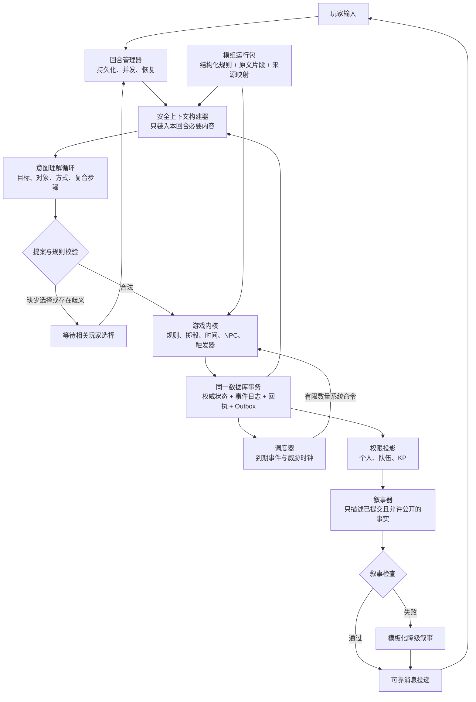
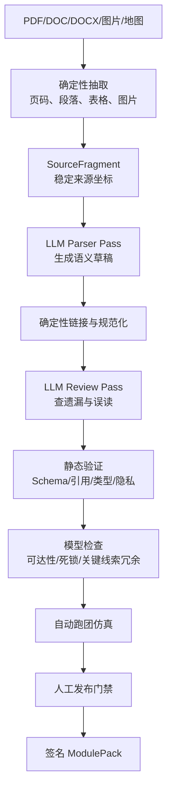
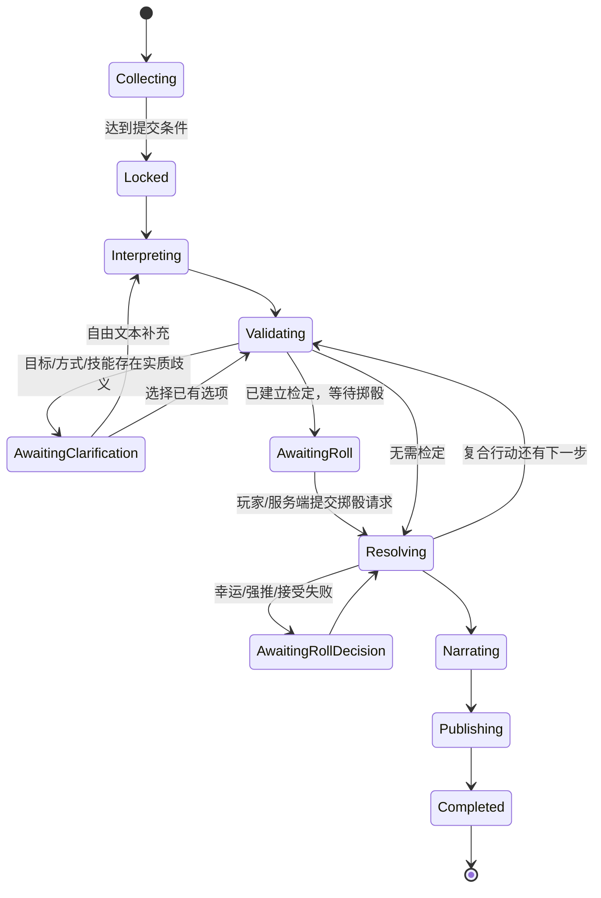

<!-- 本文件沉淀 AI 主持人系统的职责、契约边界、数据模型、运行协议与分阶段交付方案。 -->
# AI 主持人系统设计报告

- 状态：Architecture Decision / Phased Implementation Guide
- 日期：2026-08-19
- 适用仓库：TRPG-master
- 目标：优先稳定运行四个指定预设模组（单人调查、单人解谜、多人核心、多人沙盒），最终支持更多内容
- 预设模组门禁：《追书人》《银之锁》《林隙的罪恶》《坨子岛》

## 1. 结论先行

新系统不应被设计成一个拥有超长 Prompt、能够直接读写游戏状态的“全能 KP Agent”。它应当是一个以确定性游戏内核为权威、由少量受约束模型步骤辅助理解、裁决建议和表达的运行系统。

核心结构如下：



必须固定的七条原则：

1. 模型只提出结构化意图、裁决建议或叙事，不直接修改权威状态。
2. 权威状态、只追加事件、命令回执和 Outbox 在同一 PostgreSQL 事务中提交；聊天记录、摘要和检索结果不是权威状态。
3. 模组先离线编译成可审查的运行包；运行时不把整份 PDF 塞给模型。
4. 玩家可见信息在进入 Prompt 之前就按权限过滤，不能只靠提示词要求模型保密。
5. 单人和多人共用同一内核，但使用不同的 Turn Policy；多人不是多个聊天请求简单串行。
6. 失败不应轻易锁死调查。关键线索必须有替代来源或带代价的恢复路径。
7. “能通过 Schema”不等于“能跑完模组”，发布前必须通过可达性、隐私、恢复和完整跑团评测。

首版部署保持简单：一个 FastAPI 应用、一个 PostgreSQL、现有 WebSocket 和一个模型供应商适配层。本文中的模块都是代码职责边界，不是独立微服务。

### 1.1 Agent 框架选型（正式决策）

本项目采用 **OpenAI Agents SDK for Python 作为模型编排层**，不再自研通用 Agent loop。SDK 负责模型调用循环、函数工具、结构化输出、输入/输出/工具 guardrail、调用追踪和取消；项目代码只实现 TRPG 特有的 Turn、Context、Proposal、Kernel 和 Projection。

这不是把整个游戏交给 Agents SDK。SDK 的 run state、session、handoff 和 tracing 都不是权威游戏状态；房间状态仍只存在于 PostgreSQL 权威表、领域事件和命令回执中。首版也不使用 handoff 或常驻多 Agent 会话：`Intent Interpreter`、按需的 `Adjudication Advisor` 和 `Narrator` 是三个独立、短生命周期的 Agent 定义，由应用代码按已提交状态依次调用。

需要明确区分四个层次：

| 层次 | 本项目采用 | 负责什么 | 不负责什么 |
| --- | --- | --- | --- |
| Web/API 框架 | `FastAPI` + WebSocket | HTTP、连接、鉴权、消息接收和投递 | 不编排 Agent，不裁决游戏规则 |
| Agent 编排框架 | OpenAI Agents SDK `Agent` + `Runner` | 模型循环、函数工具、结构化输出、guardrail、tracing 和取消 | 不管理房间事务，不直接改游戏状态 |
| 模型访问层 | Agents SDK model/provider adapter | 显式模型选择、超时、重试、用量和供应商接入 | 不保存游戏权威状态，不决定命令是否合法 |
| 游戏执行层 | `Game Kernel`（普通 Python 领域代码） | 命令校验、掷骰、战斗、时间、NPC 状态、事件提交 | 不调用大模型，不理解自由文本 |

因此，用户输入的实际执行链是：

```text
FastAPI/WebSocket
  -> TurnManager
  -> Agents SDK Runner（模型只产出 Proposal）
  -> ProposalValidator
  -> GameKernel（唯一权威写入口）
  -> PostgreSQL 事务 / Event Store / Outbox
  -> Agents SDK Runner 的 Narrator（只描述已提交事实）
```

应用层只包装三个可测试的领域函数，不把 `Runner`、SDK session 或供应商会话对象泄漏给 Kernel：

```text
run_intent(snapshot, player_input) -> IntentResult
run_adjudication(snapshot, unresolved_case) -> AdjudicationResult
run_narration(snapshot, committed_events, audience) -> NarrationDraft
```

其中 `snapshot` 是服务端按权限和 `revision` 构造的不可变快照；模型返回值必须先通过 Pydantic DTO 和策略校验，才可以交给 Kernel。工具调用也只能访问绑定了 `room_id`、`actor_id` 和可见范围的只读工具。

#### 为什么不继续自研 Agent loop

模型工具循环、结构化输出重试、guardrail、tracing、取消和流式事件已经是成熟框架的通用职责。继续自研只会重复解决供应商差异、工具协议和调用生命周期，并把领域代码与模型 SDK 粘在一起。项目仍需自研的是 TRPG 领域内核，不是又一套通用 Agent 框架。

#### 为什么当前不选 LangGraph

LangGraph 擅长长时间状态图、checkpoint、interrupt 和恢复，但本系统已经必须持久化 `turn_runs`、`pending_decisions`、命令回执、事件和 Outbox。再把同一回合复制到 LangGraph thread/checkpoint，会产生两套恢复游标和故障对账。LangGraph 的 interrupt 恢复还会从节点开头重新执行，因此节点内的掷骰、事件提交和消息写入仍必须另外做幂等隔离，不能替代 Game Kernel。

只有当单进程 `TurnManager` 明确无法承担跨进程 Worker、数小时后台任务或大规模人工审批队列时，才重新评估 LangGraph 或 Temporal。届时它们只能调度应用服务，不能取代 `GameKernel`、事件存储和权限投影。

| 方案 | 能替项目省掉什么 | 仍然必须自研什么 | 当前结论 |
| --- | --- | --- | --- |
| OpenAI Agents SDK | 工具循环、结构化输出、guardrail、tracing、取消 | Turn、Kernel、权限、模组和事务 | **采用，边界最小** |
| LangGraph | 图编排、checkpoint、interrupt、持久化执行 | 上述全部领域能力，外加双状态对账 | 暂不采用 |
| 完全自研 Agent loop | 无第三方编排依赖 | 工具协议、循环、重试、追踪、取消及全部领域能力 | 删除该路线 |

#### 供应商兼容门禁

Agents SDK 默认最适合 OpenAI Responses 路径，也提供语言级 provider/adapter 扩展面。项目支持由服务端配置 `base_url/api_key/model_name/api_style`：Responses 兼容接口走原生路径，Chat Completions 兼容接口走兼容路径，其他协议需要薄 model adapter。“可配置任意地址和模型名”不等于保证任意服务兼容；Phase 0 必须用同一份 Pydantic 输出模型和一个只读函数工具验证结构化输出、工具调用、超时取消和错误分类。未通过能力门禁的组合不得进入生产，也不回退到自研 Agent loop。

自动化测试使用仅测试可加载的 `ScriptedModel` 返回预定结构化结果和故障，不把它作为生产备用主持。生产模型未通过启动检查时禁止开始新游戏；Intent Interpreter 或 Adjudication Advisor 运行中失效时，Turn 持久化为可恢复暂停，不推进时间、不掷骰、不写领域事件。模型恢复后从原稳定 revision 继续。

选型依据：OpenAI 官方文档将 Agents SDK 定位为由 SDK 管理工具循环、handoff、session、guardrail、tracing 和可恢复审批的 code-first 运行时；LangGraph 官方文档将其定位为带持久化和 interrupt 的低层状态图，并明确 interrupt 恢复会重新执行节点。参考：[OpenAI Agents SDK](https://developers.openai.com/api/docs/guides/agents)、[OpenAI Models and providers](https://developers.openai.com/api/docs/guides/agents/models)、[LangGraph overview](https://docs.langchain.com/oss/python/langgraph/overview)、[LangGraph interrupts](https://docs.langchain.com/oss/python/langgraph/interrupts)。

### 1.2 如何使用本报告

本文后半部分描述最终需要覆盖的能力，不代表每个阶段同时开工。实现时只把当前 Phase 的 capability、DTO、表和测试视为硬需求；后续章节是约束未来扩展方向，不能据此提前建设空接口、插件系统或通用工作流。每个 Phase 通过自己的退出条件后再引入下一批能力。

### 1.3 已确认的产品边界

| 问题 | 最终约定 | 实现边界 |
| --- | --- | --- |
| 房主能否查看 KP 秘密 | 不能。房主也是普通玩家，只拥有建房、邀请和开始游戏等管理权限 | `room_owner` 不等于 `keeper`；`keeper` 是系统内部保密范围，任何玩家令牌都不能读取 |
| `Character` 与 `Actor` 是什么 | `Character` 是开局前可编辑、可复用的用户角色卡；`Actor` 是进入某一局后创建的“局内行动实体”，玩家调查员、NPC 和怪物都属于 Actor | 开局时复制角色卡快照；HP、SAN、位置、物品和状态只修改 Actor，不反写用户角色卡 |
| 旧房间是否迁移 | 不迁移。2026-08-19 已清空本机 `app.db` 中的旧房间及其局内数据，账号和用户角色卡库保留 | 新运行时不写旧数据兼容层，也不再安排第二次清理迁移 |
| 模组能否提交 GitHub | 源代码、Schema、工具和原创测试数据可以公开；模组原文及结构化改编包必须逐份满足转载和修改发布许可 | 非商用和署名本身不产生发布权；未获许可的预设只进入本地或受限仓库，不能混入公开提交 |
| 玩家如何投骰 | 玩家在前端点击“投骰”，但骰点由服务端在首次收到该 `check_id` 的请求时生成 | 客户端不提交骰点；重复点击、重连和重试返回同一结果，大模型不生成随机数 |

房主的“管理房间”与系统的“掌握模组秘密”是两种不同权限。产品界面不创建人类 KP 身份；开发审计若需要读取 `keeper` 数据，必须走独立的本地或运维权限，不能复用房主会话。

## 2. 重构原则：旧框架不作为约束

本次不是在旧框架上继续升级，也不兼容旧的 ActionPlan、Rule、Goal、Ending 或数据库形状。旧代码只能作为待替换的实现材料；新系统是否正确，只看四个预设模组能否完整运行、状态是否可靠、秘密是否隔离以及故障后能否恢复。

需要主动丢弃的前提是：

| 错误前提 | 为什么必须删除 |
| --- | --- |
| 把玩家输入预先展开成长 ActionPlan | 世界状态一变化，剩余步骤立即过期 |
| 把模组压成少量规则和目标 | 线索、NPC 反应、替代路径和结局条件会丢失 |
| 让 Prompt 同时理解、裁决、改状态和叙事 | 一次幻觉就会污染整局 |
| 用房间级位置和记忆代表所有玩家 | 无法表达分队、躲藏、私密发现和逐玩家后果 |
| 先造通用插件、工作流或自动导入平台 | 在预设模组尚未跑通前只会增加调试面 |

幂等、事务、Outbox、版本校验等属于通用可靠性原则，可以重新实现；这不等于继承旧框架的领域模型或代码结构。

## 3. 四个预设模组提出的能力要求

### 3.1 《追书人》不是“简单线性模组”

它只有 6 页，却至少要求系统支持：

- 邻居、守墓人、图书馆、报社、书房、监视、追踪等多条调查路线；
- 检定失败后的替代来源，而不是失败即停止；
- 等待至夜晚、连续监视、锁窗等延迟生效动作；
- 发现日记、进入地穴、呼喊名字、礼貌交谈等条件性场景切换；
- SAN、临时疯狂、逃跑、战斗、死亡、疗养院、跟随地下等不同终局；
- “道格拉斯已经变成食尸鬼”与“他是否仍应被视作活着”的叙事歧义；
- 调查员提出模组未列出的合理解决方案时，主持人仍能给出有依据的后果。

所以《追书人》的验收标准应是“完整跑通多条调查与结局路径”，不是“能识别一次调查动作”。

### 3.2 《银之锁》要求状态化单人解谜

《银之锁》是单人密室模组，但它不是普通的“地点加线索”调查。它要求系统支持：

- 被捆绑、受限移动、够不到物品等持续状态与行动前置条件；
- 床角、床底、挂画、通风管、抽屉和衣柜之间的钥匙与机关依赖；
- 有限页数的速写本，以及“把简单无生命图画实体化”的受约束动态物品生成；
- 手电、白纸、时空抽屉、猫和芭斯特通信形成的跨物品组合解谜；
- 猫存活、猫死亡、是否获救、是否解除银之锁等互斥状态分支；
- 人面鼠、鬼魂和长廊袭击带来的 SAN、HP、逃跑与可选战斗；
- 根据玩家人物卡的重要之物替换少量内容，但不能让模型任意改写核心谜题。

它是《追书人》之后的第二个单人门禁，重点验证库存、消耗品、机关、动态物品约束和条件结局。

### 3.3 《林隙的罪恶》要求紧凑型多人运行时

《林隙的罪恶》推荐 1-3 名玩家，场景集中在林间木屋，适合作为第一份多人预设。它要求系统支持：

- 多名玩家分别探索一楼、二楼、柴房和地下室，并决定是否共享个人发现；
- 傍晚、入夜、全员入睡、惊醒、猎杀、黎明等阶段事件；
- 群体聆听中“所有人都会醒来，但成功者获得额外信息”的逐玩家结果；
- 每名玩家独立的位置、躲藏点、噪声、暴露、伤势、昏迷和物品；
- 敌对 NPC 的巡逻路线、目标记忆、听声转向、近战/枪械选择和失去目标后的搜索；
- 潜行、追逐、对抗检定、陷阱、武器制作、枪械、护甲、重伤和怪物能力；
- 玩家协作设伏、分头逃跑、一人吸引注意、另一人救援等并发意图；
- 原文中开放给守密人临场决定的结局，必须在发布预设前补成可审查的结局切面与边界。

这份模组通过后，才能认为多人核心成立；它不是只有聊天频道变多，而是同一世界中的多个独立行动者。

### 3.4 《坨子岛》要求真正的多人沙盒运行时

《坨子岛》包含 4 天时间轴、24 个主要地点、多个阵营、暗中跟踪、失踪者求助、天气封锁、绑架计划、祭祀截止时间、多个囚禁点和撤离结局。它要求额外支持：

- 1-4 名玩家同时在场，以及分队、合流、失联和私密信息；
- 世界时钟、威胁时钟、定时事件和条件事件并行推进；
- NPC 根据知识、目标、关系和阵营状态主动反应；
- 教团对不同玩家分别监视、追踪、抓捕，而不是只有一个房间级布尔值；
- 玩家行动之间的冲突、协助、资源竞争和先后顺序；
- 被捕不等于死亡，部分玩家被捕不等于全队结局；
- 沙盒中的核心信息具有多条独立获得路径，且关键检定失败仍能推进；
- KP 隐藏信息、个人秘密和队伍公共发现使用不同可见范围。

四个预设的验证顺序是《追书人》→《银之锁》→《林隙的罪恶》→《坨子岛》。这是依赖顺序，不是把多人从最终目标中删掉：前两份先证明单人内核和复杂解谜，第三份建立多人核心，第四份再验证长时间线和开放沙盒。

四个预设模组是当前首要交付对象。开发阶段先制作人工校对的运行包，并在模组选择页展示作者、来源链接和许可说明；不实现用户上传或自动解析。公开分发原文或改编后的 ModulePack 时，再按具体模组许可确认转载、修改和商业使用边界，不让这些后续流程阻塞本地开发和完整局验收。

| 预设 | 人数形态 | 首要验证能力 | 后续依赖 |
| --- | --- | --- | --- |
| 《追书人》 | 单人 | 调查、时间等待、线索恢复、NPC 对话、基础战斗/SAN | 单人内核 |
| 《银之锁》 | 单人 | 库存、机关、有限消耗品、动态物品、条件结局 | 单人内核 + 物品规则 |
| 《林隙的罪恶》 | 1-3 人多人 | 独立位置、私密信息、声音、巡逻、协作、战斗 | 单人内核 + 多人回合 |
| 《坨子岛》 | 1-4 人多人沙盒 | 多日时间线、阵营、分队、抓捕、营救、长程结局 | 多人核心 + 沙盒调度 |

## 4. 总体边界

系统分成一个离线边界和八个在线职责边界：

```text
Module Forge        离线：原文 -> 可审查 ModulePack
Delivery Gateway    在线：鉴权、输入、重连与可靠投递
Turn Manager        在线：收集多人意图、排序、暂停、恢复
Context Builder     在线：按权限构造不可变模型快照
Agent Orchestration 在线：Agents SDK 模型调用、只读工具、预算与降级
Game Kernel         在线：命令 -> 规则 -> 领域事件
Scheduler           在线：到期事件、威胁时钟、NPC 确定性反应
Projection System   在线：按玩家、队伍、KP 生成安全视图
Narration Guard     在线：叙事证据、受众与事实校验
```

依赖方向必须保持单向：

```text
Gateway -> Turn Manager -> Agent Orchestration -> Game Kernel
                                  |               |
                                  v               v
                            Runtime Index     Event Store
                                  ^               |
                                  |               v
                              ModulePack <- Projections
```

Agent Orchestration 只提交 Proposal，应用服务将合法 Proposal 转换为 Kernel 命令；Kernel 不依赖 Agents SDK、Prompt 或聊天协议。

### 4.1 职责与读写权限

| 系统 | 核心职责 | 可以读取 | 可以写入 | 明确禁止 |
| --- | --- | --- | --- | --- |
| `Gateway` | 鉴权、限流、接收输入、重连和投递 | 账号、房间成员、Outbox | 玩家输入、投递确认 | 绕过 Turn Manager 直接改游戏状态 |
| `Turn Manager` | 创建 `turn_id`、持久化状态机、收集多人意图、恢复 | 房间策略、开放回合、待选择项 | `turn_runs`、`turn_inputs` | 自己判定规则或生成剧情事实 |
| `Context Builder` | 构造本次模型可见的不可变快照 | 权限投影、相关 ModulePack 切片、近期事件 | Prompt 审计记录 | 读取未授权受众的事实 |
| `Agent Orchestration` | 通过 Agents SDK 理解意图、查询只读工具、提出裁决建议和叙事 | 当前上下文快照、作用域工具结果 | 模型调用记录、结构化 Proposal/Draft | 写 HP、SAN、位置、库存、时间、线索和结局 |
| `Game Kernel` | 校验命令、执行 CoC7 规则、掷骰、更新时间和状态 | 权威状态、ModulePack 规则、冻结的 ruleset profile | 权威状态、事件、命令回执、Outbox | 调用模型或信任自由文本 |
| `Scheduler` | 查找到期事件、阈值和确定性 NPC 反应 | 权威时间、时钟、触发器 | 经过 Kernel 的系统命令 | 直接写状态；无限递归触发 |
| `Projection System` | 生成玩家、队伍、NPC、KP 和 Prompt 视图 | 权威状态、事件、可见性策略 | 可重建投影或缓存 | 将 keeper/private 数据混入更宽受众 |
| `Narration Guard` | 校验叙事证据、受众、数值和状态声明 | 已提交事件、允许公开的事实 | 校验结果、降级叙事 | 重新执行命令或修改已提交结果 |

### 4.2 跨边界规则

1. 每次在线写操作都必须带 `room_id`、`turn_id`、`actor_id`、`command_id` 和 `expected_revision`。
2. 跨边界只传版本化 DTO；模型自由文本不得进入 Kernel。
3. 所有工具在服务端绑定房间、玩家、角色和可见范围，模型不能自行传入其他玩家身份。
4. Kernel 只接收有限命令，不提供任意 JSON Patch 或 SQL 工具。
5. Scheduler 每次提交后最多连续处理有限数量的系统命令，超过上限就持久化告警并暂停回合。
6. 已提交状态与叙事相互独立：叙事失败只重试或降级，不回滚已经成功的规则结算。

## 5. Module Forge：把模组变成可执行程序

### 5.1 编译流水线



人工发布门禁应保留。自动 Review 可以降低工作量，但不能替代作者授权、敏感内容、关键误读和完整性确认。

### 5.2 模组运行包 ModulePack

ModulePack 是本次重构的新运行契约，不是旧框架的升级命名。首批预设可以人工制作运行包，不必等待自动解析器完成。建议包含以下一级对象：

| 对象 | 作用 |
| --- | --- |
| `manifest` | 模组身份、版本、规则集、人数、授权、内容预警、哈希 |
| `source_map` | 每个结构化字段到 PDF 页码/Word 段落的证据映射 |
| `world` | 地点图、实体、物品、阵营、静态事实 |
| `situations` | 当前场景中可发生什么，而不是预写固定剧情 |
| `object_rules` | 锁、钥匙、容器、机关、消耗品、制作与受约束物品生成 |
| `parameters` | 作者允许按角色卡替换的预设槽位及合法候选，不允许任意改写核心谜题 |
| `knowledge_graph` | 事实、线索、误导、推论和获知范围 |
| `goal_graph` | AND/OR/可选目标、失败前进、恢复路径和收束条件 |
| `timeline` | 绝对时间、持续时间、截止时间、周期事件和条件调度 |
| `clocks` | 威胁、警觉、仪式、天气、追捕等可推进时钟 |
| `npc_profiles` | 知识、目标、禁区、关系、行为策略、说话风格 |
| `encounters` | 检定、追逐、战斗、躲藏、巡逻、噪声响应、群体威胁和退出条件 |
| `triggers` | 领域事件触发的声明式规则 |
| `endings` | 基于全局及逐玩家状态计算的结局切面 |
| `assets` | 地图、手册、音频和玩家/KP 版本的素材 |
| `narrative_policy` | 氛围、禁述事实、内容安全和叙事边界 |

上表是最终能力目录，不是 Phase 0 必须一次实现的固定大 Schema。运行包按 capability 声明启用子集；未启用的能力既不建空对象，也不提前写通用框架。

#### Phase 0 最小 ModulePack 契约

《追书人》第一条完整路径只要求以下八类数据：

```text
manifest          模组、内容版本、规则版本、授权和 capability
locations         地点、连接和移动耗时
objects           当前地点可交互对象及公开名称
facts             真相、可见范围和来源
clues             获得事实的条件、失败代价和恢复路径
npcs              知识、披露条件、关系初值和必要数值
situations        当前状态下合法的动作候选
timeline/endings  必要的定时事件和收束条件
```

每种对象统一带 `id`、`schema_version`、`source_refs`；所有跨对象引用都必须在发布前解析。`object_rules`、`parameters`、`clocks`、复杂 `goal_graph`、追逐、制作和动态物品等只在对应预设第一次需要时加入 capability。这样阶段化实施不会被最终沙盒模型绑架。

ModulePack 中三类数据不能混为一谈：

| 数据 | 示例 | 运行时作用 |
| --- | --- | --- |
| 原文片段 `source_fragments` | PDF/Word 页码或段落、图片引用 | 提供准确描述和人工追溯，不直接决定状态 |
| 结构化运行数据 | 场景、条件、检定、后果、时间线、NPC 知识 | 供 Kernel 和 Context Builder 执行或查询 |
| 运行索引 | `location_id -> situation_ids`、`npc_id -> fact_ids` | 快速找到相关运行数据和原文片段 |

JSON 运行数据不是对原文的简单压缩。原文必须保留；编译是在原文之外增加机器可检查的条件、后果、权限和来源映射。

四份预设优先以仓库内可审查的 JSON/YAML 运行包维护，不把“自动读 Word/PDF”放在游戏内核之前。每个预设至少固定 `preset_id`、`content_version`、支持人数、授权状态、规则版本和来源哈希；房间创建后冻结这些值。

### 5.3 关键建模规则

1. 时间使用单调递增的 `world_time`，例如模组开始后的分钟数；“第三日 20:00”是绝对时间，不是复用的 `hour_20`。
2. 每个行动声明预计耗时、是否可并行、是否打断、是否需要全队同意。
3. 关键线索默认遵循“三线索原则”，至少三条来源或一条 guaranteed recovery。
4. 检定失败可以产生代价、延迟、暴露或较差信息，但不能无依据删除唯一推进路径。
5. NPC 知识和世界真相分开建模。NPC 只能说自己知道、相信或愿意透露的内容。
6. 结局按 facet 组合，不把房间压成单一 `ending_id`。至少区分案件、证据、NPC、队伍、逐玩家命运。
7. 所有玩家可见文本与 KP 真相分开存储；不能依赖生成时再“提醒模型别泄密”。
8. 每个房间冻结 `module_version`、`ruleset_version` 和 `ruleset_profile`；可选规则（例如花费幸运）必须显式启用，进行中的房间不得静默变更。
9. 行动耗时优先由模组或规则提供范围；AI 只能在允许范围内提出情景化估计，Kernel 负责校验，跨越重要事件前必须让玩家确认。
10. 模组原文、规则书原文和翻译文本必须通过授权检查。运行包只存储产品有权使用的内容，不把未经授权 PDF 打包发布。

其中“三线索原则”、关键线索恢复、临时 NPC 模板和建议耗时范围属于本产品为提高可玩性设置的默认策略，不是 CoC7 原规则，也不自动覆盖模组作者的明确设计。ModulePack 必须记录 `policy_origin = ruleset | module | product_default | keeper_override`：模组声明的特殊规则可以显式覆盖通用规则；产品默认值只在前两者都未定义时生效；keeper override 只作用于房间明确启用的可选规则。任何会实质改写模组的产品默认策略都要在预设发布时显式确认。

### 5.4 关键线索与失败前进

关键线索不能只配置一个“检定成功才获得”的入口。建议使用下列契约：

```json
{
  "clue_id": "douglas_gravestone",
  "sources": ["gravekeeper_credit_success", "cemetery_records"],
  "recovery": {
    "type": "idea_check",
    "always_reveal": true,
    "failure_costs": ["advance_time", "increase_threat"]
  },
  "visibility": "party",
  "source_refs": ["paper_chase:p4:gravekeeper"]
}
```

普通失败通常只代表目标暂未实现。严重伤害、丢失重要装备或被捕优先保留给玩家明确承担风险后的孤注一掷失败。灵感检定用于让调查回到正轨：无论成功失败都给出关键线索，骰点决定获得线索的代价。

### 5.5 发布前的静态证明

Module Compiler 在对应 capability 启用后至少应产生以下报告。这里只检查声明式图和有限状态，不声称证明玩家任意自然语言行动都可达：

- 所有引用存在，规则操作属于 Kernel 支持的能力目录；
- 从每个开局模板出发，至少存在一条到达合法收束状态的路径；
- 任一关键线索首次检定失败后，仍存在恢复路径；
- 钥匙、消耗品和机关依赖不会产生无解状态，有限资源不能被重复使用；
- 动态生成物品满足模组白名单或确定性约束，不能用自由文本凭空生成任意神器；
- 时间截止事件不会在玩家没有任何反应窗口时直接触发；
- 不存在只能由隐藏事实触发、玩家却永远无法观察的必需行动；
- 每个 Ending 使用的事实都有来源，且不会把“被捕”错误折叠成“死亡”；
- 任一 PlayerView 中不含 keeper-only 字段；
- 多人状态下，地点、私有发现、噪声、躲藏、状态效果和结局可以逐 actor 表达；
- NPC 巡逻或追捕策略的每个目标、转向和失去目标条件都有合法事件来源。

## 6. Game Kernel：唯一权威

### 6.1 命令与事件

Kernel 只接收有限的高层命令：

```text
MoveActor
InspectTarget
TalkToNpc
AssistActor
TransferItem
DropItems
UseItem
InteractObject
CraftItem
MaterializeItem
HideActor
PrepareTrap
CancelAction
WaitUntil
StartCheck
SpendLuck
PushCheck
StartEncounter
SubmitEncounterAction
ShareInformation
ConfirmEnding
SystemAdvanceTime
SystemTrigger
```

每条命令必须携带 `command_id`、`room_id`、`actor_id`、`expected_revision` 和来源。Kernel 校验后在一个事务中写入领域事件与命令回执。

所有命令共用同一个版本化信封，首版不允许各服务自行发明字段：

```json
{
  "schema_version": 1,
  "command_id": "cmd_...",
  "command_type": "InspectTarget",
  "room_id": "room_...",
  "turn_id": "turn_...",
  "actor_id": "actor_...",
  "expected_revision": 42,
  "source": {"kind": "player_intent", "ref_id": "intent_..."},
  "payload": {"target_id": "gravekeeper"}
}
```

`command_type` 决定 `payload` 的 Pydantic 判别联合类型；未知字段拒绝，不能透传模型自由 JSON。领域事件同样使用 `schema_version`、`event_id`、`event_type`、`room_id`、`revision`、`causation_id`、`correlation_id`、`visibility` 和按类型校验的 `payload`。Projection 只从权威状态和事件生成，并携带 `room_id`、`actor_id/audience`、`revision` 与 `schema_version`。

`MaterializeItem`、`CraftItem` 和 `PrepareTrap` 不是给模型直接写数据库的后门：它们必须引用 ModulePack 中的对象规则、材料清单和生成约束。玩家可以自由描述“我画一把钢钳”或“我用柴房材料做捕兽夹”，但 Kernel 只有在规则允许时才生成对应物品或陷阱。

领域事件示例：

```text
actor.moved
fact.discovered
fact.shared
item.transferred
item.created
item.consumed
object.state_changed
actor.hidden
noise.emitted
action.started
action.completed
action.interrupted
check.rolled
check.resolved
resource.changed
npc.attitude_changed
npc.target_changed
clock.advanced
time.advanced
threat.triggered
actor.captured
actor.incapacitated
ending.available
```

不提供任意 JSON Patch，不允许模型直接设置 `hp`、`san`、位置、时间或结局。

### 6.2 核心在线契约

#### `ContextSnapshot`

Context Builder 为一次模型调用生成不可变快照。它记录“当时模型实际看见了什么”，不能让 Agent 在调用期间自行扩大权限。

```json
{
  "snapshot_id": "ctx_...",
  "room_id": "room_...",
  "turn_id": "turn_...",
  "actor_id": "actor_...",
  "audience": "private:actor_...",
  "revision": 42,
  "world_time": 600,
  "active_actions": [],
  "next_time_boundary": 615,
  "current_scene": {},
  "visible_state": {},
  "action_candidates": [],
  "runtime_slice": {},
  "source_fragments": [],
  "recent_events": [],
  "derived_memories": []
}
```

`runtime_slice` 必须按调用角色再次裁剪。Intent Interpreter 只能看到公开对象、合法动作候选和必要环境约束，不能看到成功后的隐藏线索、秘密触发结果或 NPC 未披露知识；这些隐藏条件只由 Validator/Kernel 在服务端读取。`source_fragments` 是带页码的少量原文，也必须经过同样的受众过滤。

#### `IntentProposal`

复合输入可以拆成多个临时步骤，但 Proposal 不是执行脚本。Kernel 每提交一步都必须以新 revision 重新验证剩余步骤；进入战斗、追逐、疯狂、玩家选择或不可逆事件时立即暂停。

```json
{
  "schema_version": 1,
  "proposal_id": "intent_...",
  "goal": "找到道格拉斯的墓碑",
  "steps": [
    {
      "step_id": "s1",
      "action": "drop_items",
      "target_ids": ["all_carried_except:pistol"],
      "depends_on": [],
      "on_failure": "stop"
    },
    {
      "step_id": "s2",
      "action": "move",
      "target_ids": ["cemetery"],
      "depends_on": ["s1"],
      "on_failure": "stop"
    },
    {
      "step_id": "s3",
      "action": "attack",
      "target_ids": ["gravekeeper"],
      "instrument_id": "pistol",
      "depends_on": ["s2"],
      "on_failure": "stop"
    }
  ],
  "ambiguities": [],
  "requires_confirmation": true,
  "source_snapshot_id": "ctx_...",
  "source_revision": 42
}
```

`action` 必须来自当前 capability 注册的枚举，`target_ids` 必须来自快照候选，`on_failure` 首版只允许 `stop` 或 `ask_player`。Proposal 在 `source_revision` 改变后自动过期，只能重新验证或重建，不能直接执行。首版限制每个 Proposal 最多 4 步、最多跨越一个普通场景；超过部分保留为玩家的自然语言目标，不预先编译成计划。进入新场景、检定、战斗、追逐、系统中断或不可逆动作时都停止自动续跑。

#### `AdjudicationProposal`

固定代码或模组规则无法直接覆盖时，AI 只能提出受约束的裁决建议：

```json
{
  "resolution": "select_candidate",
  "goal": "不惊动屋内人员进入书房",
  "candidate_id": "stealth_hard_penalty_1_duration_10",
  "reason_refs": ["scene.dark", "window.noisy"]
}
```

候选由固定规则、ModulePack 和产品默认裁决表预先生成，内部已经绑定技能、难度、奖惩骰和耗时。AI 只能选择 `candidate_id` 或返回 `clarification_required`，不能自由填写这些规则参数。Kernel 重新检查候选仍适用于当前 revision；模组明确规则优先于 AI 选择。

#### `CommandResult`

Kernel 不论接受、拒绝还是需要玩家选择，都必须返回可发布的结构化结果，避免“被规则引擎拦截后玩家没有回复”。

```json
{
  "status": "resolved | rejected | decision_required",
  "reason_code": "NO_AMMO",
  "committed_revision": 43,
  "event_ids": ["event_..."],
  "choices": ["reload", "use_other_weapon", "cancel"],
  "narration_facts": ["pistol.trigger_clicked", "pistol.empty"]
}
```

#### `NarrationDraft`

```json
{
  "audience_blocks": [
    {
      "audience": "party",
      "text": "你扣动扳机，只听见一声空响。",
      "evidence_refs": ["event_..."]
    }
  ],
  "claims": ["pistol_is_empty"],
  "suggested_ui_cues": ["show_reload_action"]
}
```

### 6.3 规则裁决分层

规则裁决按固定顺序执行：

1. **固定规则代码**：成功等级、奖惩骰、幸运、孤注一掷限制、伤害、弹药、SAN、战斗和追逐状态机。
2. **模组明确规则**：当前场景允许的特殊检定、揭示条件、时间代价、NPC 特殊反应和结局条件。
3. **AI 裁决建议**：处理模组未穷举的开放情景。根据玩家目标、环境压力、失败后果和技能定义，提出“直接成功 / 需要澄清 / 建立检定”及有依据的技能、难度和耗时候选；目录外方案只能作为待校验提案。
4. **确定性校验**：验证 AI 建议没有越权，再生成正式命令。

当前 `app/core/coc7_rules.py` 只承担建卡计算与校验，不是局内规则引擎。首版局内 CoC7 能力至少包括：

- 先声明目标，再决定是否需要检定；角色有能力、没有明显压力且失败没有有意义后果时直接成功；结果不确定、存在风险且成功失败都会改变局面时才建立 `CheckRun`；
- 常规、困难、极限成功，大成功、大失败及奖惩骰；
- 失败后接受结果、花幸运或用新方法孤注一掷的待选择状态；
- 战斗、幸运、理智、伤害等不能孤注一掷的限制；
- 群体检定的 `any_success`、`all_success`、`leader_only`、`lowest_luck` 和 `assist`；
- HP、SAN、MP、弹药、护甲、重伤、昏迷、死亡和疯狂状态；
- 战斗和追逐作为独立 Encounter 状态机。

### 6.4 时间、等待与中断

系统同时使用三种时间，但不能相互冒充：

| 时间 | 表达方式 | 负责者 |
| --- | --- | --- |
| 世界时间 | `world_time`，从模组开局起单调递增的分钟数 | Kernel 提交，Scheduler 检查到期事件 |
| 战斗时间 | 有弹性的 `round_no` 和行动顺序，不强行换算成固定秒数 | Combat Encounter |
| 追逐距离 | 一串抽象追逐地点和双方位置差，不做精确米制物理模拟 | Chase Encounter |

普通行动耗时按“模组明确值 -> 规则默认档位 -> 场景候选”的顺序取得。AI 只从服务端提供的候选档位中选择并说明依据；没有候选时进入澄清或采用已经声明的产品默认值，不能自由生成分钟数。Kernel 根据地点、交通方式、伤势和当前 Encounter 校验后提交。

#### 多人时间模型 v1：单一世界时钟 + 玩家行动区间

多人游戏不为每个玩家维护独立世界时钟。整个房间只有一个逻辑时钟：

```text
GameSession.world_time = 模组开局以来的分钟数
```

玩家可以同时拥有不同的行动区间，但所有行动都使用同一个 `world_time`：

```json
{
  "action_id": "act_...",
  "actor_id": "actor_a",
  "kind": "inspect",
  "location_id": "kitchen",
  "started_at": 600,
  "ends_at": 615,
  "interrupt_policy": "on_threat_or_choice",
  "status": "running"
}
```

例如在 10:00：

```text
玩家 A 搜索厨房：[10:00, 10:15]
玩家 B 与 NPC 交谈：[10:00, 10:30]
玩家 C 躲在卧室观察：[10:00, 10:10]
```

系统不等三个人都结束才推进，而是推进到下一个边界：

```text
next_boundary = min(
  所有行动的 ends_at,
  scheduled_events.due_world_time,
  encounter 的下一行动边界,
  可中断等待的检查点,
  clock 的截止时间
)
```

推进到边界后，Scheduler 按以下顺序处理：

1. 先处理会打断行动的系统事件，例如敌人到达、火灾、门被打开或 NPC 进入场景；
2. 再结算在该时间点结束的行动；
3. 检查同一地点、同一物品、同一 NPC 或同一目标上的冲突；
4. 通过 Kernel 提交领域事件并刷新 revision；
5. 为仍在运行的行动重新生成可见投影；
6. 让已空闲的玩家提交下一行动，不强迫仍在行动中的玩家重新提交。

同一时间点的多个行动不是由模型决定先后。v1 使用确定性顺序：系统中断 > Encounter 行动顺序 > 明确依赖 > 已预留的资源/位置 > `actor_id` 稳定排序。若这个顺序会改变生死、唯一物品归属或关键线索结果，Kernel 不猜测，而是把冲突转成 `pending_decision` 或对抗检定。

行动开始时就要检查并预留互斥资源，例如一把钥匙、一个狭窄位置、一个 NPC 的单独交谈焦点；行动结束时重新验证前置条件。预留不等于结果成功：玩家可以在搜索中被声音打断、在移动中受伤，或因为 NPC 已经离开而得到失败/替代结果。

API 响应慢、模型调用并行或玩家现实中晚几秒提交，都不会自动推进 `world_time`。只有 Kernel 提交 `advance_time` 或到达行动边界时，游戏时间才改变。这样网络延迟不会改变剧情因果。

#### 多人模型调用与权威提交

在同一个 `base_revision` 上，多个玩家的意图理解可以并行：

```text
同一只 ContextSnapshot(revision=42)
  -> Intent Interpreter A
  -> Intent Interpreter B
  -> Intent Interpreter C
```

模型只生成候选 Proposal，不写状态。所有 Proposal 返回后，由 Turn Manager 做依赖和冲突分析，再交给 Kernel 以一个确定顺序提交。任一 Proposal 提交后 revision 改变，尚未提交的 Proposal 必须重新验证；不能继续相信旧快照。

因此“AI 主持可以同时处理吗”的答案是：可以同时理解和准备多个行动，不能同时无序修改同一个世界。叙事可以在一批事件提交后按 `public/private(actor)` 并行生成，但每个叙事块都只能引用这一批已经提交的事件。

权威提交使用一条明确的数据库事务算法，Scheduler 和玩家命令共用它：

```text
BEGIN
  SELECT game_sessions ... FOR UPDATE
  校验 expected_revision 和 command_receipt
  SELECT 涉及的 actor/item/object/action ... FOR UPDATE
  校验资源预留、行动前置条件和 next_boundary
  写权威状态、领域事件、命令回执和 Outbox
  revision += 1
COMMIT
```

锁顺序固定为 `session -> actor -> item/object -> action`，避免相反顺序造成死锁。同一资源的活动预留必须落在可唯一约束的关系表 `action_reservations(action_id, resource_type, resource_id, released_at)`，不能只藏在 `reserved_refs` JSON 中。时间推进使用唯一 `SystemAdvanceTime` 命令和确定性 `dedupe_key`；Scheduler 抢不到当前 revision 时重新读取，不与玩家命令并行写入旧世界。

#### 行动占用、取消与断线

每名玩家有 `available_at` 和最多一个互斥的 `current_action_id`：

- 普通搜索、交谈、移动等行动运行期间，玩家不能再开启同一角色的第二个互斥行动；
- 行动声明 `interrupt_policy`，允许取消、允许被威胁打断或不可中断；
- 取消行动要经过 Kernel，已经消耗的时间、材料或暴露风险不能凭空回滚；
- 玩家断线不会暂停世界，行动仍按原定时间结束或被系统事件打断；
- 断线期间不能替玩家选择攻击、分享秘密、花费幸运或确认不可逆结局；
- 行动结束后，玩家重连得到从最后稳定 revision 生成的投影和待选择项。

多人时间的 v1 不追求实时即时制，也不让每个 NPC 运行独立线程。它是“离散事件推进 + 并行意图理解 + 串行权威提交”。这足以覆盖《林隙的罪恶》的分头搜索、躲藏、布置陷阱和制造声音，也能作为《坨子岛》多日时间线的基础。

`WaitUntil` 支持“休息到晚上”这类跳时，但不是把时钟直接改成目标值。Kernel 反复取 `目标时间` 与 `下一个到期事件` 中较早者，分段推进并让 Scheduler 执行到期命令：

```text
玩家要求休息到 20:00
  -> 校验当前地点是否允许等待、多人是否都已表态
  -> 推进到最近的到期事件
  -> 应用隐藏且无需选择的世界变化
  -> 若出现可感知危险、NPC 打断或玩家选择，停止等待并返回玩家
  -> 否则继续推进，直到 20:00
```

因此《追书人》开局可以让调查员建立一个结束于夜晚的 `WaitUntil` 行动。等待期间发生的敲门、闯入、跟踪、天气或威胁事件会正常打断。多人分队时，等待只占用发起者；其他玩家可以继续行动，世界时间仍由全局最早边界推进。只有模组明确要求“全队一起等待/旅行/休息”时，Turn Manager 才创建 `party_window`，要求所有受影响角色提交或使用安全的默认等待行为。等待也不等于安全休息：HP、理智或状态恢复必须另外满足规则和模组声明的安全地点、持续时间与无人打断条件。

### 6.5 NPC 状态、记忆与临时数值

NPC 记忆不是聊天历史摘要，而是四层有来源的状态：

| 层 | 内容 | 示例 |
| --- | --- | --- |
| 世界真相 | 实际发生了什么 | 瓶中确实是酒 |
| NPC 知识/信念 | NPC 知道或误以为什么 | 守墓人知道道格拉斯常坐的墓碑 |
| 关系状态 | 对每名调查员的信任、恐惧、敌意与承诺 | 信用检定成功后更愿意配合 |
| 披露策略 | 在什么条件下愿意说出哪条知识 | 留下好印象后透露墓碑位置 |

长期状态来自 `game_events`、`npc_knowledge` 和 `npc_relations`，每项都带来源事件。最近对话可以摘要，但摘要只能帮助表达，不能覆盖上述权威数据。当前谈话对象还要作为 `actor_focus` 持久化；移动、目标离场或显式转向其他对象时由 Kernel 清除或替换。

NPC 不是常驻独立 Agent。需要回应时，Kernel 先按 NPC 知识、关系和披露策略计算本次允许表达的事实集合；Narrator 只收到该集合、当前情绪、说话风格和允许看到的最近事件，而不是 NPC 的全部隐藏知识。它不能看到全模组真相，也不能自行决定态度变化或额外泄露线索。

模组预期会进入战斗的重要 NPC 必须在发布前提供数值。若玩家意外攻击一个无战斗数据的次要 NPC，Kernel 从固定模板按“非战斗人员/一般威胁/训练有素”物化一次数值；CoC7 战斗技能可分别以约 25/40/70 为基准，再由规则代码计算派生值。物化结果连同模板版本持久化，后续回合不得让模型重新编一套。模型只能建议最贴近哪个模板，Kernel 校验；无法判断时采用保守的非战斗模板。

敌对或主动 NPC 使用最小声明式行为策略，不靠叙事模型即兴决定。策略只需表达：

```json
{
  "policy_id": "esau_hunt_v1",
  "states": ["patrol", "investigate", "pursue", "search", "return"],
  "perception": {"vision_edges": 1, "hearing_threshold": 2},
  "target_priority": ["visible_threat", "loudest_recent_noise", "last_known_target"],
  "transitions": [
    {"from": "patrol", "on": "noise.heard", "to": "investigate"},
    {"from": "investigate", "on": "actor.seen", "to": "pursue"},
    {"from": "pursue", "on": "target.lost", "to": "search"},
    {"from": "search", "on": "search.expired", "to": "return"}
  ]
}
```

地点图负责视觉/声音传播，事件提供感知证据，策略按固定优先级选择目标。模型只负责把已提交行为演成自然语言。首版不实现通用行为树；每个预设只配置实际出现的有限状态和转移。

### 6.6 战斗、追逐与理智

- **战斗**：玩家说“开枪打死守墓人”表达的是攻击目标，不是保证死亡的命令。Kernel 检查武器所有权、弹药、射程和目标状态，必要时建立 Combat Encounter，再按行动顺序处理攻击、闪避/反击、伤害、重伤、昏迷和死亡。
- **追逐**：Kernel 维护抽象地点序列、参与者位置与障碍。AI 可以把自由语言映射为追逐行动，但不能决定谁追上谁。首版只实现《追书人》需要的步行追逐子集，车辆和完整高级选项后置。
- **躲藏与猎杀**：玩家的藏身点、隐蔽程度和暴露状态逐 actor 保存；开门、奔跑、枪声等动作产生带地点和强度的 `noise.emitted` 事件。敌对 NPC 的巡逻、听声转向、最后已知位置和失去目标后的搜索由行为策略与 Kernel 推进，不能让叙事模型凭气氛决定发现谁。
- **理智**：模组或规则声明何时触发 SAN 检定及成功/失败损失表达式，Kernel 掷骰、扣减并建立临时疯狂、不定性疯狂等 `actor_conditions`。AI 只描述已结算表现，不判断玩家是否“应该疯”。

Encounter 是会中断复合计划的权威边界。进入战斗、追逐、疯狂发作或角色失能后，Turn Manager 立即停止执行剩余步骤，重新向相关玩家收集行动。叙事失败不会回滚已经发生的命中、伤害或 SAN 损失。

### 6.7 PostgreSQL 持久化设计

目标数据模型不要求纯 Event Sourcing。采用“规范化权威状态表 + 只追加事件日志”，两者在同一事务更新；事件用于审计、叙事证据和恢复对账，状态表用于直接读取当前状态。下表是随预设 capability 逐步引入的最终表目录，不是 Phase 0 一次建完的迁移清单。

| 表 | 关键字段 | 权威内容或约束 |
| --- | --- | --- |
| `game_sessions` | `room_id PK`、`module_id`、`module_version`、`ruleset_version`、`ruleset_profile`、`world_time`、`revision`、`turn_policy`、`time_policy`、`status` | 房间运行头；ModulePack、Turn Policy 和 `discrete_event_v1` 时间策略创建后冻结 |
| `actors` | `actor_id PK`、`room_id`、`player_id`、`kind`、`location_id`、`status`、`hp/max_hp`、`san/max_san`、`mp/max_mp`、`luck`、`version` | 玩家、NPC、怪物当前权威状态 |
| `actor_stats` | `actor_id`、`stat_id`、`value`、`source`、`template_version` | STR、DEX 等基础与派生数值；记录人工配置或临时物化来源 |
| `actor_skills` | `actor_id`、`skill_id`、`value`、`source` | 调查、交涉和战斗技能；同一技能每名角色唯一 |
| `actor_focus` | `actor_id PK`、`focus_type`、`focus_id`、`interaction_mode`、`set_event_id`、`version` | 当前对话/观察对象，供省略主语的后续输入参考 |
| `actor_conditions` | `actor_id`、`condition_type`、`payload`、`starts_at`、`ends_at` | 重伤、昏迷、疯狂、恐惧症、被捕等可持续状态 |
| `inventory_items` | `item_instance_id PK`、`owner_actor_id`、`location_id`、`definition_id`、`quantity`、`state`、`ammo`、`version` | 只记录叙事或规则重要物品；所有权与地点二选一 |
| `runtime_item_definitions` | `definition_id PK`、`room_id`、`base_type`、`properties`、`created_event_id` | 速写本实体化、临时制作等运行期物品定义；必须通过模组约束校验 |
| `world_objects` | `object_id PK`、`room_id`、`location_id`、`definition_id`、`state`、`version` | 门、锁、抽屉、机关、陷阱和容器的权威状态 |
| `facts` | `fact_instance_id PK`、`room_id`、`fact_id`、`truth_status`、`valid_from_revision`、`invalidated_at_revision` | 当前世界事实及有效区间 |
| `fact_visibility` | `fact_instance_id`、`scope_type`、`scope_id`、`learned_event_id` | `keeper/private/subgroup/party/public` 可见范围 |
| `npc_knowledge` | `npc_id`、`fact_id`、`belief`、`confidence`、`source_event_id`、`learned_at` | NPC 知识、误信和来源；与世界真相分离 |
| `npc_relations` | `npc_id`、`actor_id`、`attitude`、`trust`、`fear`、`version` | NPC 对每名玩家的关系状态 |
| `npc_behavior_state` | `npc_id PK`、`policy_id`、`phase`、`waypoint`、`target_actor_id`、`last_known_location_id`、`version` | 巡逻、听声、搜索、追捕和攻击选择的可恢复状态 |
| `action_instances` | `action_id PK`、`room_id`、`actor_id`、`kind`、`location_id`、`started_at`、`ends_at`、`interrupt_policy`、`status`、`base_revision` | 玩家和系统行动区间；同一 actor 的活动互斥行动使用部分唯一索引，结束时必须重新验证 |
| `action_reservations` | `action_id`、`room_id`、`resource_type`、`resource_id`、`released_at` | 活动资源预留；`released_at IS NULL` 时 `(room_id, resource_type, resource_id)` 唯一 |
| `noise_events` | `noise_id PK`、`room_id`、`world_time`、`source_actor_id`、`location_id`、`intensity`、`heard_by`、`expires_at` | 声音、枪声、破门等会影响 NPC 搜索和玩家感知的事件 |
| `clocks` | `clock_id`、`room_id`、`value`、`max_value`、`status`、`version` | 警觉、祭祀、天气、追捕等时钟 |
| `scheduled_events` | `schedule_id`、`due_world_time`、`trigger_id`、`status`、`dedupe_key`、`interrupt_policy`、`audience`、`precondition` | 绝对、相对和周期事件；`dedupe_key` 唯一，前置条件由 Kernel 求值 |
| `encounters` | `encounter_id`、`type`、`state`、`round_no`、`active_actor_id`、`version` | 战斗、追逐、疯狂发作等明确状态机 |
| `encounter_participants` | `encounter_id`、`actor_id`、`side`、`order_value`、`position_ref`、`status` | 参战方、行动顺序和追逐抽象位置 |
| `check_runs` | `check_id PK`、`turn_id`、`actor_id`、`goal`、`skill_id`、`difficulty`、`status`、`roll`、`result` | 掷骰前后状态、目标和结算结果；防止重掷 |
| `pending_decisions` | `decision_id`、`turn_id`、`actor_id`、`type`、`options`、`expires_at`、`status` | 澄清、选技能、掷骰、幸运、孤注一掷、反击/闪避等暂停点 |
| `turn_runs` | `turn_id PK`、`room_id`、`state`、`base_revision`、`focus_scene_id`、`lease_until`、`error_code` | 回合状态机和崩溃恢复点 |
| `turn_inputs` | `input_id`、`turn_id`、`player_id`、`client_request_id`、`text`、`created_at` | 玩家原始输入；`client_request_id` 幂等 |
| `context_snapshots` | `snapshot_id`、`turn_id`、`actor_id`、`revision`、`audience`、`content_hash`、`payload` | 可复现模型当时所见；敏感内容按留存策略处理 |
| `model_calls` | `call_id`、`turn_id`、`role`、`provider`、`model`、`sdk_version`、`prompt_version`、`schema_version`、`input_hash`、`status`、`usage` | 模型调用审计，不保存密钥或思维链 |
| `game_events` | `event_id`、`room_id`、`revision`、`event_index`、`event_type`、`payload`、`visibility`、`causation_id`、`correlation_id` | 只追加；一次命令可在同一 revision 写多个事件，`UNIQUE(room_id, revision, event_index)` |
| `command_receipts` | `command_id PK`、`room_id`、`request_hash`、`status`、`committed_revision`、`result` | 幂等回执；相同 ID 不得对应不同请求摘要 |
| `narrations` | `narration_id`、`turn_id`、`audience`、`text`、`evidence_event_ids`、`validation_status` | 已验证或降级的发布文本 |
| `outbox_messages` | `outbox_id`、`room_id`、`recipient_scope`、`payload`、`created_at`、`delivered_at`、`attempts` | 与领域提交同事务写入，至少一次投递 |

所有可变权威记录都直接带 room scope，或通过 `actor/session` 外键归属房间，并带版本。一次命令事务按以下顺序完成：锁定 `game_sessions` revision、检查 receipt、校验命令、更新权威状态、追加事件、写 receipt、写 Outbox、revision 加一，然后提交。崩溃恢复根据 receipt 和 Outbox 对账，不根据 WebSocket 是否发送过消息猜测状态。

下列不变量必须尽量由数据库约束而不是 Python 约定保证：库存实例必须“角色持有或位于地点”二选一；同一 actor 只有一个活动互斥行动；同一资源只有一个活动预留；同一 actor 同时只有一个同类型活动 pending decision；事实有效区间不能倒置；事件只能追加。可见范围扩大只能通过显式 `fact.shared` 命令新增 visibility 记录，不能原地把 `private` 改成 `party`。

索引至少包括：

- `game_events(room_id, revision, event_index)` 唯一索引；
- `turn_runs(room_id, state)`；
- `pending_decisions(actor_id, status)`；
- `scheduled_events(room_id, status, due_world_time)`；
- `action_instances(actor_id) WHERE status = 'running'` 的互斥行动唯一索引；
- `action_reservations(room_id, resource_type, resource_id) WHERE released_at IS NULL` 唯一索引；
- `fact_visibility(scope_type, scope_id)`；
- `outbox_messages(delivered_at, created_at)` 的待投递部分索引。

### 6.8 规则集边界

CoC 7e 作为首个规则模块，提供：

- 角色卡字段与技能目录；
- 难度、奖励骰/惩罚骰、幸运、强推、对抗检定；
- HP、SAN、临时疯狂、不定性疯狂和死亡/重伤规则；
- 战斗、追逐和群体威胁的明确状态机；
- 预设明确声明的少量法术与怪物特殊能力，按结构化消耗、检定和效果执行，不先建设完整通用魔法系统；
- 面向玩家的候选选择与面向叙事的结算证据。

技能目录不能只有名称和基础值。每个已实现技能至少记录用途、适用时机、无需检定时机、典型目标、不适用目标、难度指导、失败后果、关联技能、规则书来源引用和实现状态。Adjudication Advisor 使用这些详细定义判断开放行动是否需要检定以及适合哪个技能；Kernel 负责校验候选、生成骰点并应用结果。技能目录按四个预设的实际需要增量补齐，不要求 Phase 0 一次录入整本规则书。

规则集返回结构化结果，不生成文学叙事。首版只有 CoC7，不为单一实现预建动态插件框架；先保持清晰的 Python 模块边界，第二个规则集出现时再抽象公共接口。

CoC7 原始规则书归档于 `trpg-backend/rulesets/coc7/source/克苏鲁的呼唤 守秘人规则书 40周年纪念版.pdf`，其 SHA-256 和资料状态记录在同目录 `manifest.json`。规则书用于核对规则语义、设计结构化规则和编写测试；运行时读取项目自己的 `coc7` 规则数据，不把整本 PDF 直接交给模型或 Kernel。四个预设原文分别归档于 `trpg-backend/modules/presets/` 下的中文目录，路径和哈希由各自 manifest 记录。

## 7. Turn Manager：单人与多人真正分开的地方

### 7.1 通用状态机



每个状态都必须持久化。模型超时、进程重启、玩家断线后从最后一个稳定状态恢复。

`AwaitingRoll` 与 `AwaitingRollDecision` 不能合并：前者还没有骰点，后者已经有不可变骰点，只是在等玩家决定是否花幸运、孤注一掷或接受失败。随机数由 Kernel 在服务端生成并用 `check_id/command_id` 幂等保护，大模型不负责掷骰。

是否澄清也不能完全交给模型自由判断。Intent Interpreter 先列出目标候选和不确定字段，Proposal Validator 再用确定性规则检查：必填目标缺失、同名目标不唯一、多个解释会改变技能/耗时/风险/NPC 态度/线索结果时，必须进入 `AwaitingClarification`。只有所有合法解释的规则后果相同，系统才可采用当前焦点作为默认目标。

### 7.2 单人策略

单人模式每条玩家输入通常立即锁定并处理。只有以下情况暂停：

- 输入具有会显著改变结果的歧义；
- 玩家需要选择技能；
- 掷骰后需要选择幸运、强推或接受失败；
- 行动持续时间较长，需要确认是否继续等待；
- 结局即将提交，需要玩家确认不可逆选择。

### 7.3 多人策略

多人房间支持三种明确模式：

| 模式 | 适用场景 | 提交条件 |
| --- | --- | --- |
| `free_play` | 交谈、低风险共同探索 | 任一玩家可提交；按 revision 串行提交，不等待全员 |
| `party_window` | 分队、旅行、长行动、时间推进 | 所有未失能玩家提交或主持超时关闭窗口 |
| `initiative` | 战斗、追逐、严格时序 | 按权威顺序逐 actor 提交 |

`party_window` 的处理流程：

1. 收集每名玩家的 intent，不立即写世界状态。
2. 识别依赖、冲突、协助与可并行关系。
3. 使用确定性优先级排序：规则时序、位置约束、显式协助、DEX/initiative、稳定 actor id。
4. Kernel 逐条提交；每次提交后刷新 revision，并重新验证剩余 intent。
5. 冲突无法自动解决时，只向相关玩家发起澄清，不阻塞无关分队。
6. 所有结果提交后，生成公共叙事和必要的个人私密叙事。

`party_window` 必须持久化 `required_actor_ids`、已提交者、截止策略和未提交者的默认行为。玩家断线不能永久卡住房间；默认行为只能是等待、防御或保持上一安全状态，不能替玩家作出攻击、分享秘密或消耗资源等实质选择。

多人模式必须逐 actor 保存位置、藏身点、可见目标、个人发现、状态、库存和结局，不能再使用单一房间地点。事实可见性至少支持 `private(actor)`、`subgroup`、`party`、`public`、`keeper`；同一地点发生的事也只有实际能看见或听见的玩家自动获知。

《林隙的罪恶》的典型窗口可能同时收到：“甲躲进厨房食物堆”“乙去柴房布置捕兽夹”“丙在走廊制造声音引开以扫”。Turn Manager 先检查三人的位置和资源，再判断行动是否独立；噪声成为带来源和地点的事件，NPC 行为策略据此更新目标。若两个行动争夺同一物品或先后顺序会改变结果，就切换为对抗/initiative 或只向相关玩家澄清，不能让模型随意选一个赢家。

### 7.4 世界自动推进

玩家回合完成后，由确定性的 Scheduler 检查：

- 到期的 timeline event；
- clock 阈值；
- NPC reaction policy；
- encounter continuation；
- 是否需要切换 Turn Policy；
- 是否开放或关闭结局。

Scheduler 产生系统命令并走同一 Kernel，不允许模型后台偷偷修改世界。

## 8. Agent 编排：使用 Agents SDK，不做第二个游戏引擎

### 8.1 运行角色

首版只定义三个短生命周期的 SDK Agent，不创建一群长期自治 Agent：

| 角色 | 输入 | 输出 | 是否可写状态 |
| --- | --- | --- | --- |
| `Intent Interpreter` | 玩家安全视图、原话、候选目标/动作 | 一个或多个带依赖关系的 `IntentProposal` | 否 |
| `Adjudication Advisor` | 仅在规则无法直接决定时使用 | 有依据的候选裁决与待澄清项 | 否 |
| `Narrator` | 已提交事件、可见事实、风格约束 | 分受众叙事块与证据引用 | 否 |

NPC 不应默认各自持有长期 Agent 会话。NPC 的长期一致性来自 `npc_profile + event-derived state`，需要说话时由受约束的 Narrator 根据 Kernel 已批准披露的事实生成。这比常驻多个 Agent 更便宜，也避免状态分叉和 Prompt 注入泄密。

Intent Interpreter 与 Narrator 使用不同 Prompt，正常情况下也是两次独立模型调用。前者只看到公开行动候选和必要环境约束，输出不直接发布；后者只能看到已提交事件、当前受众可见事实和本次已批准的 NPC 披露事实。Adjudication Advisor 不是每回合必调，只有固定规则和模组规则都不能决定时才增加一次调用。

Intent Interpreter 不穷举玩家的自然语言行动。它只把自由表达映射到有限动作原语、当前快照提供的对象 ID、行动方式和不确定字段；无法安全映射的创意行动交给 Adjudication Advisor，仍无法裁决时再向玩家澄清。

### 8.2 工具面

Intent Interpreter 只获得确有必要的只读函数工具；快照已经包含的内容不再包装成工具：

```text
search_visible_targets(query)
get_action_candidates(target_id)
get_public_object_details(target_id)
```

`IntentProposal` 和澄清请求通过 SDK 的 Pydantic `output_type` 返回，不伪装成写工具。Narrator 默认不使用工具，Context Builder 直接给它本回合已提交事件和该受众可见事实；只有证据体积超过上下文预算时才增加以下只读工具：

```text
get_committed_turn_events()
get_visible_facts()
get_npc_voice_profile()
```

SDK 函数工具在注册时通过闭包或 run context 绑定 `room_id`、`player_id`、`actor_id` 和 visibility scope，工具参数中不暴露这些身份字段。模型不能通过参数请求其他玩家或 keeper 视图。工具返回稳定 ID 和已过滤字段，不返回数据库对象或未裁剪原文。

只读工具暂时失败时最多重试一次。Intent Interpreter 仍无法确认目标或规则时就询问玩家，不补写事实；Intent Interpreter 或 Adjudication Advisor 不可用时持久化暂停本回合并返回 `gm_unavailable`。Narrator 失败时，只有 Kernel 已经提交成功，才使用 `CommandResult.narration_facts` 展示确定性结算结果；不得用预设对白或假主持继续游戏。

### 8.3 SDK 运行边界

应用代码不再手写“模型 -> 工具 -> 模型”的循环，由 Agents SDK `Runner` 执行。项目只保留一次 run 外围的确定性边界：

```text
ContextSnapshot
  -> Runner.run(Intent Interpreter[output_type=IntentResult])
  -> Pydantic 校验 + Proposal Validator
  -> Game Kernel
  -> Runner.run(Narrator[output_type=NarrationDraft])
  -> Narration Guard
```

每次 SDK run 固定最大 turns、工具白名单、Token/耗时预算、取消信号和 trace metadata。达到限制时返回可恢复的澄清或模板叙事，不伪造成功。SDK session 不保存游戏真相；需要继续时从 PostgreSQL 的稳定 revision 重建输入。

一次需要检定的普通回合通常是：

```text
模型调用 A：理解目标、对象与方法，输出 IntentProposal
  -> Proposal Validator 与 Kernel：决定是否检定并建立 check_id
  -> Kernel：服务端掷骰并提交结果（不调用模型）
  -> 模型调用 B：只根据已提交事件生成叙事
```

如果固定规则无法裁决，才在 A 与 Kernel 之间增加 Adjudication Advisor；如果需要澄清或骰后选择，本回合持久化暂停，收到玩家回复后继续，而不是把所有步骤塞进一次超长调用。

### 8.4 现成框架的取舍

- SillyTavern 的世界书、多角色、Prompt 预算和供应商适配值得借鉴，但其聊天记录不是 TRPG 权威状态。其 AGPL-3.0 许可也不适合直接复制代码进入当前项目。
- pi 的 Agent loop、事件回调、并行工具、steering/follow-up 队列适合作为行为参考，但不再复制其循环实现；它没有模组、规则、可见性与多人回合语义。
- deepseek-harness 的插件作用域、仅追加 Session、投影、持久化和崩溃恢复值得借鉴，但“everything is a plugin”不应照搬成首版复杂度。

当前项目是 Python/FastAPI 主栈，OpenAI Agents SDK 可以原生嵌入同一进程，不需要 TypeScript sidecar。首版只使用 `Agent`、`Runner`、函数工具、Pydantic 输出、guardrail 和 tracing；handoff、SDK memory、MCP、voice、computer use 和 hosted tools 一律不启用，直到预设模组出现明确需求。

## 9. Context Engine：记忆不是一段摘要

上下文分为五层，并按优先级装配：

1. `Rules and policy`：当前 Turn Policy、合法命令、输出 Schema。
2. `Current projection`：玩家、队伍、场景、时间、待决策与可见目标。
3. `Relevant module slice`：由 situation、location、NPC、clock 和目标图确定性检索出的结构化运行 JSON，必要时附少量带来源坐标的原文片段。
4. `Recent event window`：最近若干已提交领域事件和公开对话。
5. `Derived memory`：带来源 event ids 的人物关系、未完成承诺和长期摘要。

任何摘要都必须保存 `source_event_ids` 与覆盖区间。摘要损坏或模型漂移时可以从事件流重建。向量检索只用于召回候选，最终上下文必须经过 visibility 与事实有效性过滤。

四个预设在制作 ModulePack 时预先按 location、situation、actor、object、fact、goal、timeline 和 source fragment 切分。运行时由当前 `location_id + situation_id + action_type + audience + revision` 确定性选择结构化切片；向量检索不是四个预设的依赖。未来自动导入模组也转换成相同的 `ContextSlice` 接口，两类模组只在内容编译方式上不同。

Prompt Packer 应记录每层实际 Token、被裁剪项和模型配置，便于复现“当时模型看到了什么”。

不是每次 API 调用都能看到模组原文，更不会看到整份 PDF：

| 调用 | 可以看到 | 明确看不到 |
| --- | --- | --- |
| 意图理解 | 玩家可见状态、当前焦点、公开对象、合法动作与必要环境约束 | 成功后的隐藏线索、秘密触发结果、NPC 未披露知识、整份 PDF |
| NPC 表演 | 该 NPC 的知识/信念/关系/披露策略与当前对话 | NPC 不知道的世界真相、其他 NPC 私密知识 |
| 叙事 | 本回合已提交事件与该受众可见事实 | 未触发线索、keeper-only 事实、失败分支答案 |
| 裁决建议 | 当前行动的规则候选和必要环境事实 | 无关剧情与完整模组 |

这使模组“记忆”主要存在于 ModulePack、PostgreSQL 状态和事件中，而不是依赖模型上下文。模型每次只临时读取完成当前职责所需的一片信息；即使 Narrator 被诱导，也拿不到尚未触发的秘密。

### 9.1 模组获取策略：状态驱动，RAG 只做候选召回

运行时不把玩家原话直接送进向量数据库，再把相似段落拼成 Prompt。推荐的获取顺序固定为：

```text
玩家输入
  -> Intent Interpreter 提取动作、目标、方式和不确定字段
  -> Current Projection 限定当前 actor、地点、焦点和可见对象
  -> Runtime Index 按 id、别名、动作类型和前置条件找候选
  -> Proposal Validator 判断目标/技能/耗时/风险是否唯一
  -> 读取目标对象的结构化规则
  -> 必要时补充少量 source_fragments
```

这里的 `Runtime Index` 优先使用结构化数据库索引和别名表；向量检索只在关键词无法命中时作为第二级召回。无论使用哪种召回方式，返回值都必须是受作用域限制的 `object_id`、`situation_id`、`fact_id` 或 `source_fragment_id`，不能直接返回一段自由文本让模型自行决定事实。

每次模型调用最多获得三类模组信息：

1. **可执行切片**：Intent 只含当前场景、公开对象、合法动作和公开前置条件；隐藏效果、秘密触发和完整后果只供服务端 Validator/Kernel 使用；
2. **当前状态**：已经打开的锁、已经消耗的物品、已发现的事实、NPC 当前知识和行动时间边界；
3. **原文证据**：只有结构化数据不足以保持特定描述、需要人工核对或 Narrator 需要风格参考时，才附带少量来源片段。

语义检索召回多段相似片段时，系统不让模型自行合并。它先按 `scene_id/location_id/object_id` 去重，再按当前状态过滤无效事实，最后只把一个候选集合交给意图模型；如果候选仍有不同后果，就进入 `AwaitingClarification`。检索命中相似不代表当前事件已发生，只有 Kernel 提交事件后事实才进入世界状态。

因此《银之锁》的“床底钥匙”由 `bed_under` 对象规则决定，《林隙的罪恶》的“以扫听到声音后改变巡逻目标”由 `noise.emitted + npc_behavior_state` 决定，而不是从若干包含“床底”或“声音”的文本段落中临时猜出来。

### 9.2 完整示例：“过个侦察”

场景是调查员正在和公墓看守梅洛迪亚斯交谈。结构化模组规则声明：观察看守本人并通过侦察检定，可以发现其外套口袋露出的玻璃瓶；观察墓园环境则是另一组目标和结果。

| 步骤 | 系统行为 | 是否调用模型 |
| --- | --- | --- |
| 玩家说“过个侦察” | Context Builder 给出当前焦点 `gravekeeper`，同时列出可观察的 `gravekeeper` 与 `cemetery` | 否 |
| 理解输入 | Interpreter 输出 `action=inspect`、`skill=spot_hidden`，目标候选有两项 | 是，意图调用 |
| 校验歧义 | 两个目标会触发不同线索，Validator 强制暂停并问“观察守墓人本人，还是观察周围墓园？” | 否 |
| 玩家选择“看守墓人” | 若回复命中已有选项，直接填入 pending decision；自由文本无法匹配时才重新理解 | 通常否 |
| 建立并执行检定 | Kernel 建立 `check_id`，进入 `AwaitingRoll`，随后服务端只生成一次骰点 | 否 |
| 成功提交 | 同一事务写入 `check.rolled`、`check.resolved`、`fact.discovered(glass_bottle_visible)`、耗时和回执 | 否 |
| 表达结果 | Narrator 只看到成功事件和已公开事实，描述玩家看见一截玻璃瓶；不能顺便说出瓶中一定是酒或墓碑位置 | 是，叙事调用 |

如果玩家一开始说“我仔细看他的外套口袋”，目标已经唯一，就不应多问。反之，仅靠“上一回合在和守墓人说话”不能强行把无目标的“侦察”解释成观察本人，因为该选择会改变线索结果。

### 9.3 完整示例：复合且会进入战斗的行动

玩家说：“先把身上除了手枪的东西都放下，然后去墓地开枪打死守墓人，再去找道格拉斯的墓碑。”Interpreter 可以生成临时步骤，但系统按以下方式执行：

1. `DropItems` 展开实际库存并保留手枪；Kernel 提交后重新检查角色仍拥有什么。
2. `MoveActor(cemetery)` 校验路线和耗时，途中到期事件可以打断；抵达后刷新场景与 NPC 状态。
3. “打死”被规范化成攻击目标，不被视为必然结果。Kernel 校验手枪和弹药，必要时物化守墓人临时数值并 `StartEncounter`。
4. 一旦进入战斗，复合计划立即暂停。后续每次攻击、NPC 反应、伤害与逃跑都按 Encounter 回合处理。
5. “寻找墓碑”不会被预先执行。只有战斗结束、角色仍能行动且玩家再次确认后，才以新 revision 重新提案和检定。

装备是否存在、是否已放下、是否有弹药都读权威库存表；AI 只识别玩家想用哪件装备，不能因为叙述里提到“手枪”就凭空创建一把。

## 10. Narration Guard：防止叙事污染状态

Narrator 的输入只能包含已提交事件和允许公开的模组片段。输出必须是：

```text
NarrationDraft
  audience_blocks[]
  evidence_refs[]
  claims[]
  suggested_ui_cues[]
```

发布前执行两层校验：

1. 确定性检查：每个事实性 claim 必须引用允许该受众看到的 event/fact id；数值、位置、物品、伤亡、检定结果和线索发现必须逐项匹配，keeper 内容不得进入玩家块。
2. 语义检查：只用于发现可能遗漏的自由文本 claim 和改善表达，不能作为秘密隔离或状态正确性的唯一安全边界。

Narrator 不得声明证据集合之外的新事实；无法确定性验证的句子只能是不会改变世界理解的感官修辞。失败时只重试 Narrator，不重新执行 Kernel。达到重试上限后，只有存在 committed receipt 才由 `CommandResult.narration_facts` 展示确定性结果；提交前的模型失败必须暂停 Turn，不能用模板替代主持判断。

Actor 的死亡、失能、位置和存在状态始终以当前权威投影为准。已死亡 NPC 不得再次进入存活目标候选；Narrator 声称其行动、对话或复活时必须因缺少事件证据被拒绝。重启和后续回合都从 PostgreSQL 的稳定 revision 重建状态，不能从模组初始设定或聊天摘要恢复 NPC。

## 11. 供应商与模型策略

优先使用 Agents SDK 的 model/provider 扩展面，不在项目内再造一套完整 Provider 框架。项目只保留薄配置与兼容性门禁，统一记录：

- JSON Schema/结构化输出能力；
- tool calling 能力；
- context window 与输出上限；
- timeout、retry、rate limit 与 usage；
- 可用时的 prompt cache 标识；
- 模型版本和请求追踪 id。

推荐路由：

| 工作 | 模型要求 | 降级策略 |
| --- | --- | --- |
| 意图理解 | 低延迟、稳定 JSON、中文理解 | 同模型重试一次，再询问玩家 |
| 模组解析 | 长上下文、强推理 | 分块解析 + Review，不在线降级 |
| 裁决建议 | 强规则遵循 | 规则模板或要求玩家澄清 |
| 叙事 | 中文文风、证据遵循 | 短模板叙事保证回合完成 |

不要在同一个进行中的 Turn 中无记录地切换模型。每次调用都把 provider、model、SDK version、prompt version、input hash 和 schema version 写入遥测。供应商不支持某项 SDK 能力时必须在启动检查中明确失败或关闭该能力，不能运行中静默降级成不同语义。

## 12. 可靠性与可观测性

### 12.1 必须成立的不变量

- 同一 `command_id` 永远不会重复掷骰或重复应用效果；
- 任一发布叙事都能追溯到已提交事件；
- 断线重连只重放稳定结果，不重新调用 Kernel；
- 模型失败不会留下半个领域提交；
- 任何玩家永远只能获取当前权限允许的投影；
- 单个玩家断线不会让其他分队的无关行动永久阻塞；
- 进程重启后，开放 Turn、待选择检定和未投递消息都可恢复；
- ModulePack 版本在房间创建后固定，升级必须显式迁移。

### 12.2 遥测

每个玩家输入建立统一 trace：

```text
room_id -> turn_id -> intent_id -> command_id -> event_ids -> narration_id -> outbox_id
```

至少记录阶段耗时、模型用量、工具次数、Schema 重试、检索命中、状态 revision、投递重试和恢复次数。生产日志不记录 API key、完整 keeper 内容或不必要的玩家隐私。

## 13. 评测体系：必须跑完整局

评测分四层：

| 层 | 是否调用真实模型 | 验证内容 |
| --- | --- | --- |
| Kernel tests | 否 | 规则、时间、触发器、事件、幂等 |
| Module model checking | 否 | 可达性、死锁、线索冗余、结局合法性 |
| Scripted playthrough | 否 | 从开局到结局的完整路径与故障恢复 |
| Model playthrough | 是 | 自由语言理解、叙事、沙盒偏航和多人协调 |

### 13.1 《追书人》发布门禁

至少包含以下完整局：

1. 邻居/守墓人路线，最终礼貌交谈并离开。
2. 图书馆/报社路线，追踪进入地穴。
3. 监视金博尔宅，锁窗导致破窗，随后追逐。
4. 关键检定连续失败，仍通过恢复路径推进。
5. 杀死道格拉斯并面对食尸鬼群。
6. 临时疯狂进入疗养院。
7. 跟随道格拉斯进入地下。
8. 每个故障点重启或重试后仍只产生一次权威效果。

### 13.2 《银之锁》发布门禁

至少包含：

- 使用铅笔刀、床角或合理替代方法解除绳索，约束状态只解除一次；
- 三把钥匙、三个抽屉、挂画、床底和通风管的依赖关系不会错乱；
- 速写本页数不可重复消费，生成物只允许简单无生命物且属性经过 Kernel 校验；
- 白纸、时空抽屉、猫和芭斯特通信可以形成完整可达路径；
- 猫存活/死亡、银之锁生效/解除、玩家逃走/被抓回等分支状态一致；
- 人面鼠、鬼魂与绑架者相关的 SAN、HP、逃跑和战斗结果都由规则事件驱动；
- 角色卡定制只替换声明过的参数槽，不改变钥匙数量、谜题依赖或秘密答案；
- 任一阶段重启后，消耗品、锁和机关不会复原或重复触发。

### 13.3 《林隙的罪恶》发布门禁

至少包含：

- 1 人和 3 人两种规模都能从抵达到黎明或合法结局；
- 三人分散探索不同房间时，地点、私密线索、库存和叙事不会串线；
- 全员入睡与惊醒作为群体事件执行，但聆听成功带来的额外信息逐玩家投影；
- 以扫按巡逻、听声转向、追踪、失去目标和重新搜索的状态机行动；
- 玩家躲藏、制造声音、分头逃跑和共享信息时，NPC 只依据可感知事件反应；
- 捕兽夹、临时武器、猎枪、护甲、重伤、昏迷和死亡使用权威规则结算；
- 一名玩家失能或被寄生时，其余玩家仍能继续行动，不能提前结束全队回合；
- 杀死/制服以扫、逃出木屋、躲到黎明、发现夏盖妖虫等路径都有明确结局切面；
- 真实模型多人连续运行时，不重复消费物品、不泄漏未分享线索、不因单人断线永久卡住。

### 13.4 《坨子岛》发布门禁

至少包含：

- 1、2、4 人三种房间规模；
- 全队同行、两组分队、玩家被捕后其余玩家继续三种组织形态；
- 正常登岛与被教团船只诱骗两种导入；
- 完整经历第一日至第四日的所有定时事件；
- 证据与营救、独自带证据逃离、仅存活、被捕但存活四类结局；
- 不同玩家持有私密线索后选择分享或隐瞒；
- 真实模型连续运行至少 100 个 Turn，不出现状态漂移、秘密泄漏或无法恢复的等待。

模型评测不能只断言 HTTP 200 或 Schema 通过。必须断言任务完成率、无依据声明率、秘密泄漏率、卡死率、恢复成功率和平均每 Turn 模型调用数。

## 14. 在当前仓库中的落地结构

保留现有 React、SDK、FastAPI、PostgreSQL 和 WebSocket 外壳。首个垂直切片先沿用现有 `core/dto/models/service` 分层，不为每个职责新建一层目录：

```text
trpg-backend/app/
  dto/gm.py                 # Command、Event、Proposal、Projection 契约
  models/gm.py              # SQLAlchemy 权威状态、事件、回执和 Outbox
  core/coc7_runtime.py      # 纯规则计算与 Encounter 状态转换
  service/gm_runtime.py     # 首条路径的 Turn、Kernel、Context 与 Agents SDK 编排

trpg-backend/modules/presets/
  追书人/                   # 《追书人》单人预设运行包
  银之锁/                   # 《银之锁》单人预设运行包
  林隙的罪恶/               # 《林隙的罪恶》1-3 人预设运行包
  坨子岛/                   # 《坨子岛》多人沙盒预设运行包

trpg-backend/rulesets/coc7/
  source/                   # CoC7 规则书原文，仅作离线参考
  manifest.json             # 规则集来源、哈希和结构化实现状态

trpg-backend/tests/
  test_gm_kernel.py
  test_gm_paper_chase_playthrough.py
  test_gm_silver_key_playthrough.py
  test_gm_forest_gap_multiplayer.py
  test_gm_recovery.py
```

上述是部署与代码边界的起点，不要求把所有逻辑永久塞在四个文件。只有当 `gm_runtime.py` 出现可独立测试的稳定职责或明显变大时，再按 `turn/context/agent/narration/store` 拆成 `service/gm/` 包；数据库仍是一个，调用仍在同一 FastAPI 进程内。Agents SDK 依赖只允许出现在 service/adapter 层，`dto/gm.py`、`core/coc7_runtime.py` 和 Kernel 事务代码不得导入它。

## 15. 开发阶段预估


### Phase 0：建立全新重构基线

- 先用 `openai-agents` 做供应商兼容 spike：一个 Pydantic 输出和一个只读函数工具，通过后才锁定 adapter；
- 只定义 Phase 0 最小 ModulePack，以及第一条路径实际使用的 DomainEvent、Command、Projection 和 Turn 判别联合 DTO；
- 只建立第一条路径需要的权威状态表、只追加事件日志、命令回执和 Outbox，其余表随 capability 引入；
- 新运行路径不适配旧 ActionPlan、Rule、Goal 或旧状态存储；
- 人工制作《追书人》黄金运行包和普通 pytest 完整局样例，不先造自动导入平台。

退出条件：SDK 兼容 spike 通过；纯 Kernel 可以从新房间执行第一条路径需要的命令、提交多个同 revision 事件、崩溃恢复并重放同一稳定结果。此时不要求战斗、多人、自动编译或全部最终数据库表存在。

### Phase 1：《追书人》单人完整门禁

- 实现移动、调查、交谈、等待、检定、装备、NPC 记忆和关键线索恢复；
- 实现最低限度 CoC7 战斗、步行追逐、HP、SAN、疯狂与结局；
- 接入 Intent Interpreter、歧义澄清、Narrator、权限投影和模板化降级；
- 跑通本文 13.1 的全部脚本路径与真实模型路径。

退出条件：《追书人》不是只能走一条演示路线，而是主要调查路线、失败路线和结局都能稳定完成；重试不会重复掷骰，Narrator 不会泄露未触发秘密。

### Phase 2：《银之锁》单人解谜门禁

- 实现门锁、钥匙、容器、机关、够取距离、受限移动和物品组合；
- 实现有限资源消费、速写本物品生成约束、时空抽屉和跨对象触发；
- 实现猫、芭斯特、银之锁和绑架者的条件状态与互斥结局；
- 实现作者允许的角色卡参数槽，不允许模型自由改写核心谜题。

退出条件：本文 13.2 全部通过，任意重启点不会复制钥匙、纸页或已经生成的物品，也不会出现核心谜题无解。

### Phase 3：《林隙的罪恶》多人核心门禁

- 实现逐 actor 位置、库存、藏身、伤势、私密发现和受众投影；
- 固化 `discrete_event_v1`：单一 `world_time`、`action_instances`、最早边界推进、同刻确定性结算和可中断等待；
- 实现 `free_play`、`party_window`、`initiative`、协助、冲突和断线默认行为；
- 实现群体事件、逐玩家检定结果、声音事件、NPC 巡逻/搜索/追捕状态机；
- 补齐陷阱、制作、枪械、护甲、重伤、昏迷、怪物能力和逐玩家结局；
- 把原文中“由守密人自行决定”的结局整理成发布前可审查的预设边界。

退出条件：本文 13.3 全部通过，1-3 人可以分头、协作、失能和重连，且任何一名玩家不会读到未共享的私人信息。

### Phase 4：《坨子岛》多人沙盒门禁

- 增加多日 timeline、clock、天气、阵营、监视、追捕、抓捕和营救；
- 支持 1-4 人分队、合流、失联、部分被捕和逐玩家结局；
- 增加 ModulePack 可达性、关键线索冗余和时间窗口检查；
- 运行多路径完整局与至少 100 Turn 的真实模型连续测试。

退出条件：本文 13.4 全部门禁通过，才能宣称系统支持长篇多人沙盒。

### Phase 5：自动导入与扩展规则

- 在四份人工黄金运行包稳定后，再实现 Parser/Review Agent 和人工发布工作台；
- 处理地图、handout、来源映射和授权记录；
- 扩展高级战斗、车辆追逐、魔法与第二个规则集；
- 根据实际遥测决定是否增加缓存、向量检索或通用工作流框架。

## 16. 第一个可执行检查点

第一批代码只做一条端到端路径：

```text
《追书人》黄金 ModulePack
  -> 创建单人房间
  -> 调查员询问/调查/移动/等待
  -> 发生一次需要玩家选择的检定
  -> Kernel 写事件
  -> Narrator 引用事件生成叙事
  -> 断线后恢复
  -> 达成“与道格拉斯交谈后离开”结局
```

这个检查点只证明新链路能贯通，不代表《追书人》已经完成。通过后应继续执行 Phase 1 的全部门禁，再依次进入《银之锁》《林隙的罪恶》和《坨子岛》。自动 PDF 导入、常驻 NPC Agent、复杂多 Agent 协作、向量数据库和 LangGraph 都不应阻塞这四份预设的实现。

## 17. 参考项目取舍

本设计于 2026-08-19 审查以下公开版本：

- [SillyTavern](https://github.com/SillyTavern/SillyTavern) `8172dcd0`：借鉴多角色交互、World Info 激活、上下文预算、Prompt 可观测性和 Provider 适配。
- [deepseek-harness](https://github.com/deepseek-ai/deepseek-harness) `99f6f02f`：借鉴仅追加 Session、投影、持久化检查点、作用域工具、队列与崩溃恢复。
- [pi](https://github.com/earendil-works/pi) `59a71b23`：借鉴最小 Agent loop、事件流、工具调用验证、steering/follow-up 和 Provider 抽象。

它们提供的是通用 Agent 运行机制或角色聊天机制，不提供 TRPG 所需的模组可达性、规则权威、玩家可见性、多人意图合并和完整局验收。这些必须由本项目自己的领域内核实现。

本报告还用《追书人》《银之锁》《林隙的罪恶》《坨子岛》的模组正文和《克苏鲁的呼唤 守秘人规则书 40 周年纪念版》做了能力校验，抽取的是设计约束而不是正文中的主持指令或叙事文本：先声明检定目标、日常行动免检、强推与幸运的限制、灵感检定的关键线索恢复、战斗回合的弹性时间、追逐的抽象地点、SAN 的多阶段状态、状态化解谜、动态物品约束、逐玩家投影、声音与巡逻，以及缺少完整 NPC 数据时的临时战斗模板。当前优先交付四个预设的可运行 ModulePack；原文上传、自动解析和公开分发审查后置。公开发布时再逐份确认原文、翻译、图片和结构化改编包的许可，不把授权流程变成预设开发的前置阻塞。
