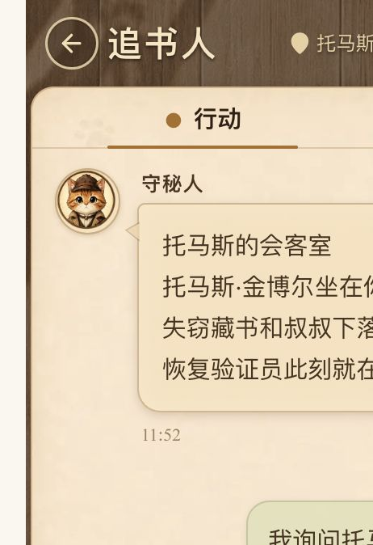

<!-- 本文说明可靠回合协议的生产切换、客户端恢复、运维观测与回滚边界。 -->

# 可靠回合协议迁移与运维

Issue #6 将玩家动作统一收口到 `Turn Coordinator`。生产链路固定为：创建或恢复
`TurnRecord`、推进 ActionPlan、由 Engine 在权威事务写入 receipt、持久化最终结果与
Narration Outbox，最后进行至少一次 WebSocket 投递。WebSocket 是否在线不改变权威结果，
`GET /api/v1/rooms/{roomId}/turns/{turnId}` 是刷新、断线和发送结果不确定时的恢复来源。

## 发布与迁移顺序

1. 备份数据库，并确认没有失败的 Alembic 迁移；
2. 执行 `uv run alembic upgrade head`，确认只有一个 head；
3. 部署包含可靠回合协议的后端，再部署由同一 OpenAPI 生成的 SDK 和前端；
4. 观察 Turn、receipt、Outbox 和 dead letter 指标，再开放玩家流量。

PR3 删除了临时 `legacy | shadow | v2` 配置，生产环境不再读取
`TURN_RUNTIME_MODE`。所有动作都使用数据库房间占用；进程内 action lock、直接叙事广播、
`room.rejoin` 和零散 ActionPlan 恢复路径均已删除。

服务启动时只收养信息完整的非终态旧记录：ActionPlan 必须保存原始玩家输入，单动作检定
必须仍在等待技能或掷骰后选择并保存玩家安全摘要。收养 Turn、房间占用和 ActionPlan
`turn_id` 回写在同一事务完成。终态历史与信息不完整记录保持原样，不伪造 Turn、receipt
或完成结果。

## 客户端恢复协议

客户端提交动作前在 session storage 保存 `clientActionId` 和输入；收到 `turn.started`
后补充稳定 `turnId`。刷新或重连后按以下顺序恢复：

1. 已知 `turnId` 时调用 `getTurn`；
2. 只有 `clientActionId` 时调用 `findTurnByClientAction`；
3. 定位信息缺失时调用 `listTurns({activeOnly: true})`；
4. 根据 `recoveryAction` 展示等待、技能选择、掷骰后选择、安全错误或最终结果；
5. 只有服务端明确要求时才调用 `resumeTurn`，不得重新生成新的动作 ID 猜测结果。

session storage 不保存 reconnect token、Prompt、模型原始输出或 GM-only Context。房间连接
恢复统一使用 `room.join`，动作结果恢复统一使用 REST Turn 查询。

下图使用隔离 SQLite 数据库和 Fake Host/Narrator 验证：发送动作后立即刷新页面，客户端
重新定位原 Turn，并从持久化结果恢复同一条玩家输入与最终叙事。



## 投递与幂等

最终消息只有在 ResultSnapshot、Outbox、回放事件和 `delivering` 状态原子提交后才允许发送，
顺序固定为：

```text
narration.chunk* → narration.push → view.updated → turn.completed
```

所有动作事件携带 `turnId`，并继续保留 `correlationId/clientActionId`。Outbox 使用稳定
`messageId` 和原 payload 至少投递一次；重连重放不得重新调用 Engine 或 Narrator。无在线
接收者不增加失败次数，真实发送失败最多重试五次，之后进入可审计 dead letter。客户端按
`messageId` 去重，不能把 WebSocket 收到与否当作权威提交证明。

## 观测与故障处理

运维检查至少包含：

- 非终态 Turn 数量、lease 到期时间与 `recoveryAction`；
- 每个 Turn 的 receipt 数量和 Engine request ID；
- Outbox 的 `pending | leased | dispatched | dead_letter` 分布与尝试次数；
- 同一房间是否存在异常的多个活动 Turn；
- Issue #4 基线指标是否恶化。

Narrator 失败只从 `awaiting_narration` 恢复；已有 receipt 时禁止回到 Engine。投递失败只重发
同一 Outbox。模型重试预算耗尽后等待玩家显式恢复，后台 supervisor 不得无限消耗模型费用。

## 回滚边界

代码回滚前必须停止新动作流量并检查未完成 Turn。数据库迁移采用向前修复，不能删除仍被
Turn、receipt、Outbox 或事件引用的数据。已提交 Turn 不得交给旧链重做；若客户端版本需要
回滚，仍必须保留 REST Turn 查询和带 `turnId` 的服务端协议，直到所有非终态 Turn 收束。

回滚或人工修复必须记录目标 Turn、当前 `commitState`、receipt、Outbox 状态和采取的动作，
不得通过删除记录来“解除卡住”。任何人工合并、重放或 dead letter 处理都需要二次 Review。
